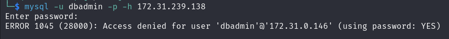
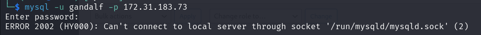

## Enumeration & Reconnaisance
### nmap
1. fastscan
nmap -p- --max-retries 1 -sS -Pn -n 172.31.158.178 -oA fastscan
  - if it's delaying, what do I do?
    - it's slow but you can wait 
2. topports
nmap --top-ports 1000 -sS -Pn -n 172.31.158.178 -oA topports
  - why closed ports showed?
    - just sometimes I think
3. detailed
nmap -p 22,80,139,445,3306,8081 -sV -sC -Pn -n 172.31.158.178 -oA detailed 

## Vulnerabilities assessment

### SSH
- OpenSSH 8.2p1 ubuntu  2020 but recent
- scripts
  - method 
- check 
  - default creds e.g. root:root root:passwords
    X 
  - ssh key get in the host  

### HTTP
1. 80
- nginx 1.18 ubuntu 2020 
  - nothing vulerable on searchsploit
  - Nginxpwner later because it's like web scanner
  - Kyubi skip
- Builder : Nicepage 3.15.3 2021, nicepage.com 
  - web application I guess
  - known vulns X 
  - I added to the hosts file, but no more gobuster scan found  
    - -x file extension?
    - gobuster dir -u http://172.31.239.138 -w /usr/share/dirb/wordlists/common.txt -t 20 -x php,html,txt,bak,bac,zip,jpg  
      - X

* gather more valid users 
- from another services 
- gobuster recursive, another file 
  - no just fucking check source code
- read the cheat sheet one more time

- DNS enumeration
  - I know there's no chance
  - gobuster dns -w shubs-subdomains.txt -d looz.com -t 20

is it possible to get looz.com(80) too cause they are in the same www-data ?

- What do you do : rebranding, design company 

- wappaylyzer : X 
- ctrl U source code 
  - why I can't get the response? 
  - wp password y0uC@n'tbr3akIT
    - wordpress? we need to leverage this 

- dir brute force 
  - gobuster dir -u http://172.31.158.178 -w /usr/share/dirb/wordlists/common.txt -t 20 -o gobuster.output
    - nothing > another wordlists 
    gobuster dir -u http://172.31.158.178 -w /usr/share/dirbuster/wordlists/.txt -t 20 -o gobuster.output
      - nothing 

2. 8081
- Apache 2.4.38 2019
  - apache2ctl needs to be installed if you wanna exploit this Local priv escalation
- blackice-icecap means firewall SW

- what do you do 
  - dir brute force > I don't know but we needt o leverage wpadmin login page, wpscan 
    - wpscan 
  - why direct to 80? 
    - but it's only index.php , another file doesn't direct me

- dir brute force
  - I can't curl but gobuster possible
  - wp-admin, wp-includes , wp-contect, xmlrpc.php 
    - I didn't do with cookie
    - gobuster dir -u http://wp.looz.com/wp-admin/ -w /usr/share/dirb/wordlists/common.txt -t 20 -x php,html,txt -c 'wordpress_7038799421cc4b68bb6477f0f82b74e9=john%7C1721340780%7CpA9uLzHp3op9ukXK1Ee47aclXi0PBcxDF6R5rNHhyM0%7C5dc1c29d5e69c18d07d097bd6bc1dad65a0f7508c8f40dd5a2b54b1ce2b8568f; wordpress_test_cookie=WP%20Cookie%20check; wp-settings-time-1=1721143469; wp-settings-1=libraryContent%3Dupload%26posts_list_mode%3Dlist%26mfold%3Do; wordpress_logged_in_7038799421cc4b68bb6477f0f82b74e9=john%7C1721340780%7CpA9uLzHp3op9ukXK1Ee47aclXi0PBcxDF6R5rNHhyM0%7Cd7ae50e9071840e2a16b11df389c6905f4c0dd30ed4fce9ae9e0c21c86119f41'
      - not working, try without cookie
      - looz.com - 80
      - wp.looz.com - 8081

  - language php? 
    - yes
  - means wordpress surely
    - /wp-admin/, but I think need to add looz.com domain hosts, why ? 
      - how can I login or access? 
    - vi /etc/hosts 
      - why you need to do set hosts file is they are supposed to map wtf.com - specific IP address. , that's why I need to add IP on wp.looz.com, maybe
        - yes that's right, 172.31.185.71   wp.looz.com looz.com, no need to add ports.

    - what is wp.looz.com 
      - curl http://wp.looz.com
        - no response , I think it's actual internet site, not localhost
          - should I add to hosts file or not? 
          - yes why not let's do this, it's gonna be work, but included wp. ? 
            -  ping looz.com > check output's ip address ()
            - but it's not working, skip for now
            - one more time wiht another results .php pages
  - file extension
    - gobuster dir -u http://172.31.185.71:8081 -w /usr/share/dirb/wordlists/common.txt -t 20 -x php,html,txt -o gobusterfile.output 
      - php,html,txt (default)
      - yeah it's more results
      - /wp-login.php
        - need creds creds find 
        - wp-config.php (I can't see the source code) 
        - or hydra brute force
        - forgot password
          - I think I can find the validuser with it
      - /wp-links-opml.php
        - version exposure 
        - WordPress/5.7.2 - 2021
          - but the important thing is plugin or theme version.  
          - SQLi for specific plugin > check what plugin, version
          - of course some wordpress scripts are here  
          - but I think wpscan is better(they can scan vulnerable plugins themes, enumerate validusers )
        - php 7.4.20 
          - 2019
          - nothing specifal with php 
      - readme.html
        - check default setting?, wp-config.php , etc.
        - installation : /wp-admin/install.php - to reinstall, need to clean the old DB
        - wp-config.php with DB connection details
          - I can checkout DB creds and creds too in wp-config.php
          - admin:password(given?) 

* I need valid userlist
- so all I can do is wpscan 
wpscan --url http://172.31.176.64 --passwords pass.txt | tee wpscan.output
  - no need to aggressive mode or something? plugins, or -e enumeration mode, all at ap , etc.
    - --detection-mode [default: mixed, passive, aggressive] for plugin, version detection too
  - john:y0uC@n'tbr3akIT found on Xmlrpc(POST METHOD). and userlists.txt
    - as well as trial to ssh
      - no I think password spraying with hydra is faster  
    - that was admin
      - admin page>  
      - file, image upload or
        - php-reverse-shell.php
        - revshells.com > php revshell 
        - onliner webshell
        - wso.php secure webshell
          - not permit
            - LFI
            - whitelist? no, blacklist > I think if included with php in name, they block. file extension change php5 etc. 
            - mime type
      - plugin exploit
        - can I activate or install the plugins and exploit?
        - upload with plugin.zip on old version, but it's not able to install access to internet/plugin directory  
          - php upload rather than zip 
            - /wp-content/uploads/2024/07/php-reverse-shell.php.php
              - revshell get (pentestmonkey)
                - fully tty shell upgrade
                  - no there's no python
                  - and no /home users. 
                  - I don't care all I want is /var/www/html/wp-config.php
                    - maybe users cred's cached or stored or mysql creds 
                    - secretkey looks md5, SHA1 > john > X   
                  - and I can get actual dir lists > vuln exploit possible
                    - no I don't need web vulns, creds 
                    
#### Default path to check credential 
In wp-config.php you can find the root password of the database.
Default login paths to check: /wp-login.php, /wp-login/, /wp-admin/, /wp-admin.php, /login/
  - nothing but it's worthy to look it up

even though you're in www-data docker, 
you need to run linpeas.sh
  linpeas.sh upload and execute

env
  MYSQL_ENV_GPG_KEYS 177F4010FE56CA3336300305F1656F24C74CD1D8 
  MYSQL_ENV_MYSQL_USER=dbadmin
  wordpress db password = Ba2k3t
  MYSQL_PORT_3306_TCP=tcp://172.17.0.2:3306
  MYSQL_NAME=/wpcontainer/mysql
  GPG_KEYS=42670A7FE4D0441C8E4632349E4FDC074A4EF02D 5A52880781F755608BF815FC910DEB46F53EA312
  
  Mysql : User - dbadmin:Ba2k3t, root:root-password > 
    hydra -L userlist.txt -P password.txt ssh://172.31.183.73 -V -s 22
    hydra -L userlist.txt -P password.txt mysql://172.31.183.73 -V -s 3306
    X
 
    mysql upload? 
    mysql -u root -p -h 172.31.183.73
      password

    no need to copy and parse > mysql dump
    mysqldump -u dbadmin -p'Ba2k3t' -h 172.31.239.138 wpdb wp_users > wp_users.sql.dump
    `cat wp_users.sql.dump | grep '(' | tail -n 7 | cut -d "'" -f 4 > db.hash`
    john --wordlist=/usr/share/wordlists/rockyou.txt db.hash
      lag too much
      hashcat -a 0 -m 0 -o hashcat.output --outfile-format 2 db.hash /usr/share/wordlists/rockyou.txt
      `loveme2`
        hydra -L userlist.txt -p 'loveme2' ssh://172.31.183.73 -V -s 22 
          X
        hydra -L userlist.txt -p 'loveme2' mysql://172.31.183.73 -V -s 3306 
        how to convert usernames into uppercase for first character?
          What should I do with this ? let's login in wordpress for now
          hydra -L userlist.txt -p 'loveme2' 172.31.183.73 -s 8081 http-post-form "/wp-login.php:log=^USER^&pwd=^PASS^:incorrect" -V
            it says uppercase doesn't matter. galdalf:loveme2

    

      or you can `mysql -u <user> -p <database> --execute="SELECT * FROM sometable" -X > out.xml`
      ssh hydra but I think apply both of Capital character or non-Capial one.  

      

              
        - theme, plugin edit > webshell or revshell .php
          - use another means to edit by using SFTP(just sftp USER@IP with ssh) or ssh 
            - but we can edit inactive plugins.php(Hello Dollly) > active  > /wp-content/plugins/hello.php 
              but it's not working
            - hydra with password spraying or 
              - hydra -L userlist.txt -p "y0uC@n'tbr3akIT" ssh://172.31.185.71 -V -s 22
            - with default rockyou brute forcing
              - hydra -L userlist.txt -P /usr/share/wordlists/rockyou.txt ssh://172.31.185.71 -s 22

      - barely Stored XSS etc
        - no need to get cookie session, cause I'm admin. 
      - exploit API
      - I can administrate the users 
        - reset password 
        - change a role
        - gandalf is also admin
      - what I need to do from now on is 
        - exploit with authenticated > shell get = I'm in the admin means, I can exploit a lot of functions and exploit authenticated vulns 
        - user creds > ssh get
        - www-data webshell 
        
  - theme but no plugin found.

  - can I use xmlrpc.php? how?
    - update a file webshell and execute (authenticated)
      - whitelist 

  - wpscan after login 
    - wpscan --url wp.looz.com --cookie-string='wordpress_7038799421cc4b68bb6477f0f82b74e9=john%7C1721340780%7CpA9uLzHp3op9ukXK1Ee47aclXi0PBcxDF6R5rNHhyM0%7C5dc1c29d5e69c18d07d097bd6bc1dad65a0f7508c8f40dd5a2b54b1ce2b8568f; wordpress_test_cookie=WP%20Cookie%20check; wp-settings-time-1=1721143469; wp-settings-1=libraryContent%3Dupload%26posts_list_mode%3Dlist%26mfold%3Do; wordpress_logged_in_7038799421cc4b68bb6477f0f82b74e9=john%7C1721340780%7CpA9uLzHp3op9ukXK1Ee47aclXi0PBcxDF6R5rNHhyM0%7Cd7ae50e9071840e2a16b11df389c6905f4c0dd30ed4fce9ae9e0c21c86119f41'
      - wpscan --url wp.looz.com --cookie-string='wordpress_7038799421cc4b68bb6477f0f82b74e9=john%7C1721340780%7CpA9uLzHp3op9ukXK1Ee47aclXi0PBcxDF6R5rNHhyM0%7C5dc1c29d5e69c18d07d097bd6bc1dad65a0f7508c8f40dd5a2b54b1ce2b8568f'
      - nothing?
      - twentytwentyone 2.2

### MySQL
- MySQL 5.5.5 2016 but nothing interesting not many vulns in Mysql , 10.5.10-MariaDB 2021
  - Code Execution / Privilege Escalation 5.5.51  look complex
  -  'mysql' System User Privilege Escalation / Race Condition
  - 
- scripts
  - skip 
  - default salt `z<Z2'kiKyBzb[%@Tf%$$`?
    - nothing
  
- check 
  - default creds e.g. root:x , 
  or simple root:root root:password
  - mysql -u root -p 172.31.158.178
    - can't connnect through client?
      - no you've got wrong creds!! 
      - 
      - 

- creds > hydra brute force 
  - hydra -L userlist.txt -p "y0uC@n'tbr3akIT" mysql://172.31.185.71 -V -s 3306
  - manual
    - mysql -u john -p 172.31.185.71
  -I think it's disabled at all.

what's the difference between normal user(dbadmin) and root? 
and is there any possible way to exploit in Mysql client?
  root user can access to databases(
    mysql - I can get hash of DB users (MySQL Sha-1)
      john --wordlist=pass.txt mysql.hash --format=mysql-sha1
      hashcat -a 0 -m 11200 -o mysqlhash.output --outfile-format 2 mysql.hash /usr/share/wordlists/rockyou.txt
        hashcat -m 1420 --example-hashes
        but can't 
    
    performance_schema
      nothing

but most of the function are what dbadmin can use without grant_priv  

I wanna get a shell of mysql user

cat /etc/ImageMagick-6/mime.xml | grep -i 'BEGIN PGP PUBLIC KEY BLOCK' -A 10 -B 10

ssh key? 
or cloud docker PGP key ?

MYSQL_ENV_GPG_KEYS=177F4010FE56CA3336300305F1656F24C74CD1D8
GPG_KEYS=42670A7FE4D0441C8E4632349E4FDC074A4EF02D 5A52880781F755608BF815FC910DEB46F53EA312 
  (SHA1, MYSQL5SHA1)
PHP_SHA256=1fa46ca6790d780bf2cb48961df65f0ca3640c4533f0bca743cd61b71cb66335

    cracking directly or
      mysql-sha1 , Raw-SHA1
      
    by using this masterkey, getting into the further set of keys
      like imports or 
      gpgv (GnuPG) 2.2.12 :  stripped-down version of gpg, only able to check signatures

BEGIN PGP PUBLICK KEY--- how about it?

  what is GPG
  public key cryptography? to manage public keys , make a key, sign, and encrypt data etc. > usually RSA to have compatibility 
    gpg --full-generate-key
    backup :export a public keys: --armor > publickey.gpg
     import
     --import publickey.txt

Possible private SSH keys were found!
/etc/ImageMagick-6/mime.xml 

#### more specific
scripts

how can I extract all files in host? to kali?
scp, but ssh's not running 
tar -cf sourcecode.tar ./* > http: get

wp-config.php contains secret keys? Mysql settings... 
  Idk 

### SMB 
there was SMB but closed?  can I turn on? or just config file?

## Exploitation & Initial access

## Post Exploitation