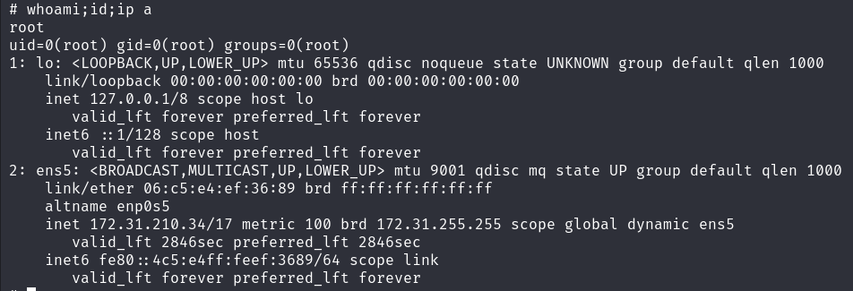

## Enumration & Reconnaisance
### nmap 
1. fastscan
nmap -p- --max-retries 1 -sS -Pn -n 172.31.164.18 -oA fastscan
  too stuck > --min-rate 3000 : good
2. topports
nmap --top-ports 1000 -sS -Pn -n 172.31.164.18 -oA topports
  closed ports shown
    I think no need to show closed. like only --open 
3. detailed
nmap -p 22,80 -sV -sC -Pn -n 172.31.164.18 -oA detailed
  Service detection performed. 
  due to -sC 

banner grabbing working
-sC working but detection shown


## Vulnerability assessment

### SSH openSSH 8.9p1 
not less than 7.7 

script
  auth : only privatekey 
  nmap -p 22 -Pn -n -sV --script auth 172.31.164.18

### HTTP apache 2.4.52 2021
x

title : \xEB\xA0\x88\xEB\x93\x9C\xEB\x9D\xBC\xEC\xBF\xA4\xEC\xBD\x94\xEC\x9D\xB8  RedRaccoon Coin
  hex 

script 
  enum
  /uploads 

  vuln
  
  exploit


what do you do
it's broken
  because of Korean 
  레드라쿤코인
레드라쿤코인에 오신 것을 환영합니다! 이 강력한 암호화폐의 특징과 이점을 알아보고 디지털 금융 환경을 혁신하고 있습니다.

레드라쿤코인 RedRaccoon Coin
혁신적인 기술
레드라쿤코인은 최첨단 블록체인 기술을 활용하여 안전하고 효율적인 거래 플랫폼을 제공합니다. 혁신적인 접근은 수수료를 최소화하면서 빠르고 안정적인 거래를 보장합니다. 전문가와 아마추어를 가리지 않고 일관된 강력한 사용 경험을 제공합니다.

안전한 거래
레드라쿤코인은 안전성이 핵심입니다. 고급 암호화 기술과 안전한 거래 프로토콜로 디지털 자산의 안전을 보장합니다. 거래가 무단 접근과 사기에 대해 보호되어 있어 안심하고 사용할 수 있습니다.

지원하기
레드라쿤 코인은 필요한 인재를 상시채용하고 있습니다. 지원하기 페이지로 가셔서 이력서를 업로드해주세요.
but redraccoon coin
coin, encrypt, crypto, apply resume, platform  
  I think we can upload resume and get manager's host RCE
    macro execution , but it's not in Windows
    metasploit exploit/multi/fileformat
    or manually 
    VBA script
    a python helper script
    a python wrapper 
    https://github.com/JohnWoodman/VBA-Macro-Reverse-Shell.


  Can I rename the file?
    if contains pdf, it's okay, so I would ~~~~~~~~~~~~limit.pdfphp
    - cause it's uploaded in raw
```
a = 'B' * 50
prtin(a)


import random
import string

text = ''.join(random.choices(string.ascii_letters, k=50))
print(text)
```

not working


ctrl U
  annotation > /upload.php 

  https://your-redraccoon-coin-image-url  vhost?
    I don't think so cause https, and even if I set vhost, nothing image load from that 


upload.php
  bypass
  it's blacklist?
    accept if contains 'pdf' > pdff 
    if not, not allowed 
      it's not about magicbytes
      it's not about content/mime-type


  where? and what names uploaded?  
    /?/cat.pdf


dir brute forcing - gobuster
1. simple
gobuster dir -u http://172.31.210.34/ -w /usr/share/dirb/wordlists/common.txt -t 20 -o simple -f
  /index.php/
    config, path, version, data phpinfo.php?
    php version :  8.1.2-1ubuntu2.14 2021
      not PHP 8.1.0-dev right? 
    system OS : 22.04.1-Ubuntu 
      no
    php config path : /etc/php/8.1/apache2/php.ini
    

    apache
    webmaster@localhost - web server user
    server root /etc/apache2
    document root /var/www/html
    remote_port 60958 ? 
    
    invocation_id ? 4b705eb5f7104617a8901e35dfeac1c6
    apache_log /var/log/apache2

    
  /uploads/

with file extension
gobuster dir -u http://172.31.210.34/ -w /usr/share/dirb/wordlists/common.txt -t 20 -x php,html,txt -o file -f
  

2. detailed
gobuster dir -u http://172.31.210.34/ -w /usr/share/dirbuster/wordlists/small -t 20 -o detailed -f

with file extension
gobuster dir -u http://172.31.210.34/ -w /usr/share/dirbuster/wordlists/small -t 20 -x php,html,txt -o detailed_file -f 


3. recursive : upload.php/
gobuster dir -u http://172.31.210.34/upload.php -w /usr/share/dirb/wordlists/common.txt -t 20 -o upload -f


recursive : /icons/
gobuster dir -u http://172.31.210.34/upload.php -w /usr/share/dirb/wordlists/common.txt -t 20 -o upload -f


later
  `-x bak,bac,zip,back,backup,docs,xlxs,git`
gobuster dir -u http://172.31.210.34 -w /usr/share/dirb/wordlists/common.txt -t 20 -x zip,docx,pdf,doc,git,xlxs -f
  I didn't have to put -f for file extention


if you have no idea, you would check OSCP cheatsheet instead of walkthrough
I mean , if you're new, know the all range of OSCP , and remember all and then practice and make it mythings. it's faster way. because there are very tricky new stuffs that I have never seen before. 


#### File upload 
do possible ways all  
test.pdf.php
that was easy. don't miss out.


## Exploitation and Initial Access 


## Post-Exploitation and Privilege escalation

not in docker
1. manual first
user : msrobot, mrrobot


I can change to the another user with su instead of ssh @localhost

default same password msrobot > got 


history 
or cat .bash_history

sshpass -p 'Secr3tP@ssw0rd' mrrobot@localhost -vv

sshpass -p 't@uyM59bQ' ssh username@server.example.com -vv
rightaway in shell commands, without interactive

sshpass -p 'kali' ssh -o StrictHostKeyChecking=no kali@localhost
if you don't have hosts in /etc/hosts, they're gonna ask 


mrrobot : Secr3tP@ssw0rd


but I think it needs to check what is inside msrobot too.


sudo -l > perl -e shell




## Review & Remind

1. annotation with directory brute forcing > upload.php
2. file upload bypass 
  .pdf.php
  - try all the ways
  > shell got
3. cat /etc/passwd > 2users got
  msrobot same creds > su msrobot
    .bash_history or history > mrrobot creds got 
4. mrrobot : sudo -l > sudo perl shell got   