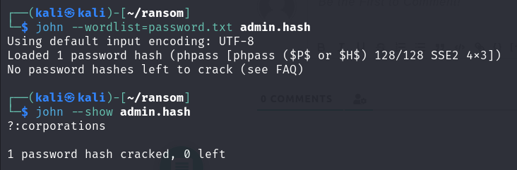

#### Python 
sudo apt update
curl https://bootstrap.pypa.io/pip/2.7/get-pip.py --output get-pip.py
sudo python2 get-pip.py

sudo apt install python-pip

so where's enum.py or enum/_init_.py
I need enum module? 
I think it's becuase enum.py is the same with enum.
in current dir,  and bad magic number - due to enum.pyc

#### johntheripper, hashcat

hashcat -a 0 -m 0 -o hashcat.output --outfile-format 2 james.hash words3.cewl
    if you don't know the type, try it without -m, they let you know. 
    -m 400 - phpass(MD5-wordpress)    

if john result shows No password hashes without session completed, you need to see --show like using Hashcat
`john --show admin.hash `

if you get into session completed or hashcat-exhuasted
I think if you pick right wordlist, even if you don't give them the hash type, they would work well.
> so it's the wordlist's problem
